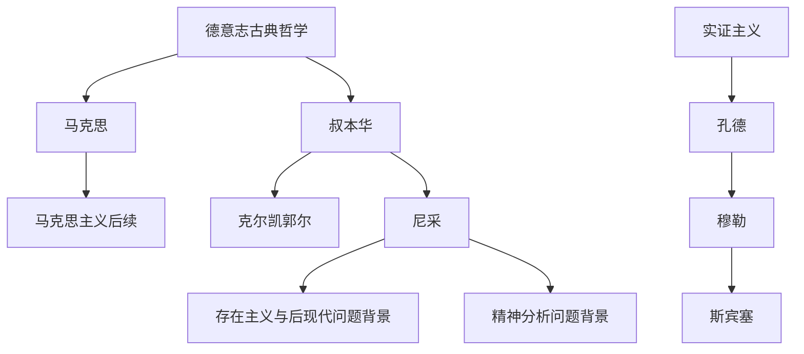

# 过渡时期

## 时间

1844年至1900年前后。

## 概括

19世纪后半叶是从德意志古典哲学向现代哲学分化的过渡时期。马克思把黑格尔和费尔巴哈的问题转向实践、社会关系和资本主义批判；叔本华、克尔凯郭尔、尼采强调意志、个体、信仰、非理性和价值重估；孔德、穆勒、斯宾塞代表实证主义和社会科学化倾向。到 1900 年前后，结构主义、列宁主义、西方马克思主义、存在主义、后现代主义和精神分析等后来方向已经获得思想前提。

## 演变关系

## 主要人物

| 方向 | 人物 | 关键思想 |
|---|---|---|
| 马克思主义 | 马克思 | 实践感性学、感性现实、自由自觉、社会历史性、生产与人的本质、唯物史观、阶级与资本、异化、共产主义。 |
| 非理性主义 | 叔本华 | 意志本体论、世界乃意志表象、理念、审美、禁欲。 |
| 存在主义前史 | 克尔凯郭尔 | 美学、伦理、宗教三阶段，自由选择，信仰。 |
| 实证主义 | 孔德 | 实证主义、科学万能、社会静力学与社会动力学。 |
| 经验主义与自由主义 | 穆勒 | 可能感觉、穆勒五法、伦理利己主义。 |
| 社会进化论 | 斯宾塞 | 社会达尔文主义。 |
| 价值批判 | 尼采 | 权力意志、价值重估、超人、酒神精神、上帝已死、永恒轮回。 |

## 后续方向

| 后续方向 | 关联线索 |
|---|---|
| 结构主义 | 对语言、结构和系统关系的关注。 |
| 列宁主义 | 马克思主义在革命理论和政治组织上的发展。 |
| 西方马克思主义 | 对资本主义、意识形态、文化和异化问题的再解释。 |
| 存在主义 | 个体存在、自由、选择、焦虑和意义问题。 |
| 后现代主义 | 对形而上学、主体和总体叙事的怀疑。 |
| 精神分析学 | 欲望、无意识、主体裂隙和文化症候。 |

## 说明

- 这个阶段的共同特点是古典体系瓦解后，哲学问题转向历史、社会、生命、意志、科学和主体危机。
- 马克思与尼采分别从社会历史和价值生命两个方向开启现代思想的重要路径。
- 实证主义推动知识科学化，但也引出对工具理性、社会进化论和科学主义的反思。

## 上级

- [西方哲学](/%E4%BA%BA%E6%96%87%E7%A7%91%E5%AD%A6/%E5%93%B2%E5%AD%A6/%E8%A5%BF%E6%96%B9%E5%93%B2%E5%AD%A6/README.md)

## 参考图

