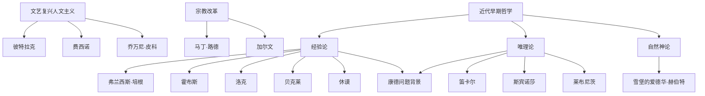

# 近代早期西欧哲学

## 时间

14世纪至18世纪。

## 概括

近代早期西欧哲学从文艺复兴人文主义、柏拉图主义复兴和宗教改革开始，逐渐转向自然科学方法、主体意识、国家与社会契约、经验论和唯理论。这个时期的核心张力是：知识应从感觉经验出发，还是从理性观念和演绎结构出发。

## 演变关系

## 主要人物

| 方向 | 人物 | 关键思想 |
|---|---|---|
| 人文主义 | 彼特拉克、蒙田、托马斯·莫尔 | 人的尊严、古典复兴、怀疑主义、乌托邦。 |
| 柏拉图学园 | 费西诺、乔万尼·皮科 | 柏拉图主义复兴、人文主义与神学结合。 |
| 库萨的尼古拉 | 库萨的尼古拉 | 泛神论倾向、自然之书、神即宇宙。 |
| 宗教改革 | 马丁·路德、加尔文 | 因信称义、反自由意志、神恩独作、预定论。 |
| 经验论 | 弗兰西斯·培根 | 四假象、科学归纳法、知识就是力量。 |
| 经验论 / 政治哲学 | 霍布斯 | 自然状态、社会契约、利维坦、机械论、功利主义倾向。 |
| 经验论 | 洛克 | 白板说、感觉与反省、第一性质与第二性质、自然权利。 |
| 经验论 | 贝克莱 | 存在就是被感知、物是观念集合、上帝感知。 |
| 经验论 | 休谟 | 印象与观念、因果问题、归纳问题、心理主义。 |
| 唯理论 | 笛卡尔 | 普遍怀疑、我思故我在、心物二元、天赋观念、理性演绎。 |
| 唯理论 | 斯宾诺莎 | 神即自然、实体、属性、样式、身心平行、自由与必然。 |
| 唯理论 | 莱布尼茨 | 单子论、前定和谐、有纹路的大理石、神正论。 |
| 自然神论 | 雪堡的爱德华·赫伯特、马修·廷德尔 | 理性宗教、普遍宗教观、自然神学。 |

## 说明

- 文艺复兴并非直接否定中世纪，而是把古典资源、人文主义和新科学问题重新组合。
- 经验论强调感觉经验、归纳、心理过程和自然权利；唯理论强调确定性、演绎、实体和先天观念。
- 经验论与唯理论共同构成康德批判哲学的问题背景。

## 上级

- [西方哲学](/%E4%BA%BA%E6%96%87%E7%A7%91%E5%AD%A6/%E5%93%B2%E5%AD%A6/%E8%A5%BF%E6%96%B9%E5%93%B2%E5%AD%A6/README.md)

## 参考图

