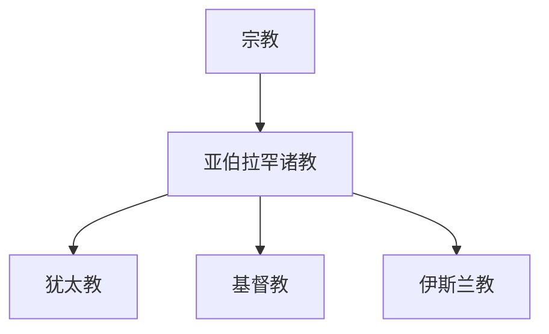

# 宗教

## 概括

宗教笔记按传统、地域、教义谱系和历史演变组织。阅读时要区分几个层次：宗教传统、教派分支、经典系统、礼仪制度和具体政权史；这些层次常互相影响，但不能彼此等同。

## 主要主题

| 主题 | 范围 | 入口 |
|---|---|---|
| 亚伯拉罕诸教 | 犹太教、基督教、伊斯兰教的共同传统、差异和相互关系 | [亚伯拉罕诸教](/%E4%BA%BA%E6%96%87%E7%A7%91%E5%AD%A6/%E5%AE%97%E6%95%99/%E4%BA%9A%E4%BC%AF%E6%8B%89%E7%BD%95%E8%AF%B8%E6%95%99/README.md) |

## 整理原则

- 宗教史笔记优先区分“信仰谱系”和“政治传播”：同一宗教可能借政权扩张传播，政权也可能借宗教获得合法性。
- 教派分裂应写清争议对象，例如神学权威、教会组织、继承合法性、仪式规范或政治领导权。
- 与文字、民族、国家相关的内容只作为背景说明，不把文字系统、民族谱系或国家史直接等同于宗教谱系。
