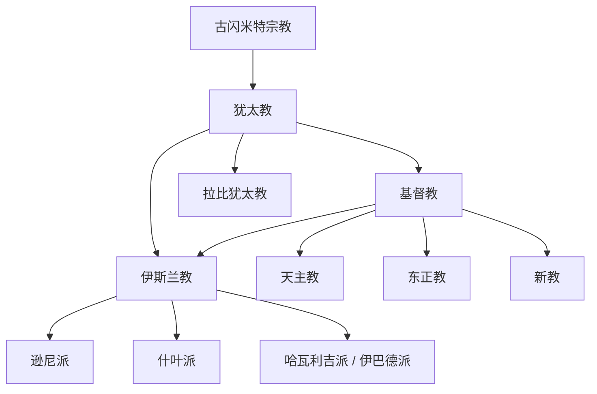

# 亚伯拉罕诸教

## 概括

亚伯拉罕诸教指把亚伯拉罕传统视为重要源头的一组一神教传统，核心包括犹太教、基督教和伊斯兰教。三者都强调唯一神和先知传统，但在耶稣身份、经典权威、共同体制度和救赎观上有根本差异。

## 演变关系

## 核心传统

| 传统 | 形成背景 | 核心经典 | 关键辨识点 |
|---|---|---|---|
| 犹太教 | 古代以色列人与第二圣殿、拉比传统 | 《希伯来圣经》、塔木德传统 | 强调与上帝立约、律法和犹太共同体身份 |
| 基督教 | 公元 1 世纪犹太宗教环境中的耶稣运动 | 《旧约》《新约》 | 承认耶稣为基督；多数主流教会接受三位一体 |
| 伊斯兰教 | 7 世纪阿拉伯半岛的宗教和社会变革 | 《古兰经》、圣训传统 | 认穆罕默德为最后的先知，强调认主独一和乌玛共同体 |

## 子主题

- [起源与相互关系](/%E4%BA%BA%E6%96%87%E7%A7%91%E5%AD%A6/%E5%AE%97%E6%95%99/%E4%BA%9A%E4%BC%AF%E6%8B%89%E7%BD%95%E8%AF%B8%E6%95%99/%E8%B5%B7%E6%BA%90%E4%B8%8E%E7%9B%B8%E4%BA%92%E5%85%B3%E7%B3%BB.md)
- [基督教](/%E4%BA%BA%E6%96%87%E7%A7%91%E5%AD%A6/%E5%AE%97%E6%95%99/%E4%BA%9A%E4%BC%AF%E6%8B%89%E7%BD%95%E8%AF%B8%E6%95%99/%E5%9F%BA%E7%9D%A3%E6%95%99/README.md)
- [伊斯兰教](/%E4%BA%BA%E6%96%87%E7%A7%91%E5%AD%A6/%E5%AE%97%E6%95%99/%E4%BA%9A%E4%BC%AF%E6%8B%89%E7%BD%95%E8%AF%B8%E6%95%99/%E4%BC%8A%E6%96%AF%E5%85%B0%E6%95%99/README.md)

## 原始图示

