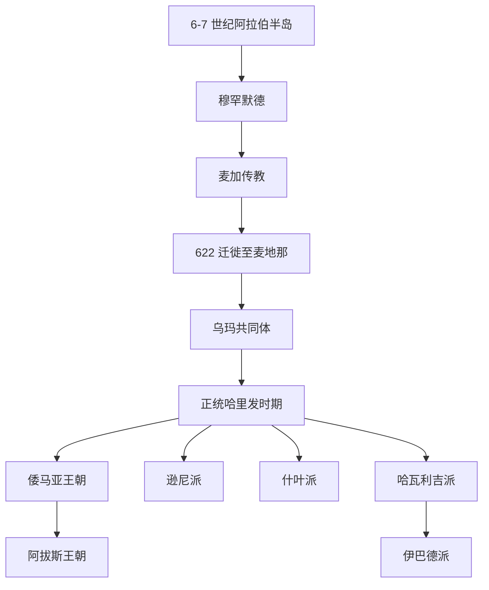

# 伊斯兰教

## 时间

- 兴起：7 世纪初
- 穆罕默德传教：约 610 年起
- 迁徙至麦地那：622 年
- 正统哈里发时期：632-661 年
- 倭马亚王朝：661-750 年
- 阿拔斯王朝：750-1258 年

## 概括

伊斯兰教兴起于 7 世纪阿拉伯半岛，以认主独一、穆罕默德为最后的先知、《古兰经》为核心启示为基本特征。穆罕默德去世后，穆斯林共同体围绕政治与宗教领导权继承产生分歧，逐渐形成逊尼派、什叶派等主要分支。

## 演变关系

## 说明

- 穆罕默德早期在麦加传教，后因部族冲突和宗教压力迁往麦地那；622 年的迁徙成为伊斯兰纪年的起点。
- 麦地那时期，伊斯兰教从宗教共同体进一步发展出具有政治、法律和军事组织能力的乌玛共同体。
- 穆罕默德去世后，继承问题没有以单一制度完全固定，首任哈里发阿布·伯克尔、欧麦尔、奥斯曼和阿里后来被逊尼派称为“四大正统哈里发”。
- 阿里与穆阿维叶之间的冲突、隋芬战役和仲裁争议，是逊尼派、什叶派和哈瓦利吉派分化的重要政治背景。
- 倭马亚王朝建立后，哈里发制度逐渐王朝化；阿拔斯王朝取代倭马亚王朝后，伊斯兰世界的政治中心转向巴格达。

## 主要分支

| 分支 | 形成背景 | 特点 |
|---|---|---|
| 逊尼派 | 接受早期共同体推选和既成哈里发秩序 | 重视圣行、圣训和法学共同体传统；人数最多 |
| 什叶派 | 强调阿里及其后裔的特殊合法性 | 重视伊玛目权威，内部又有十二伊玛目派、伊斯玛仪派等分支 |
| 哈瓦利吉派 / 伊巴德派 | 反对阿里接受仲裁的一派演变而来 | 现存主要延续为伊巴德派 |

## 子主题

- [逊尼派与什叶派](/%E4%BA%BA%E6%96%87%E7%A7%91%E5%AD%A6/%E5%AE%97%E6%95%99/%E4%BA%9A%E4%BC%AF%E6%8B%89%E7%BD%95%E8%AF%B8%E6%95%99/%E4%BC%8A%E6%96%AF%E5%85%B0%E6%95%99/%E9%80%8A%E5%B0%BC%E6%B4%BE%E4%B8%8E%E4%BB%80%E5%8F%B6%E6%B4%BE.md)

## 原始图示

## 上级

- [亚伯拉罕诸教](/%E4%BA%BA%E6%96%87%E7%A7%91%E5%AD%A6/%E5%AE%97%E6%95%99/%E4%BA%9A%E4%BC%AF%E6%8B%89%E7%BD%95%E8%AF%B8%E6%95%99/README.md)
