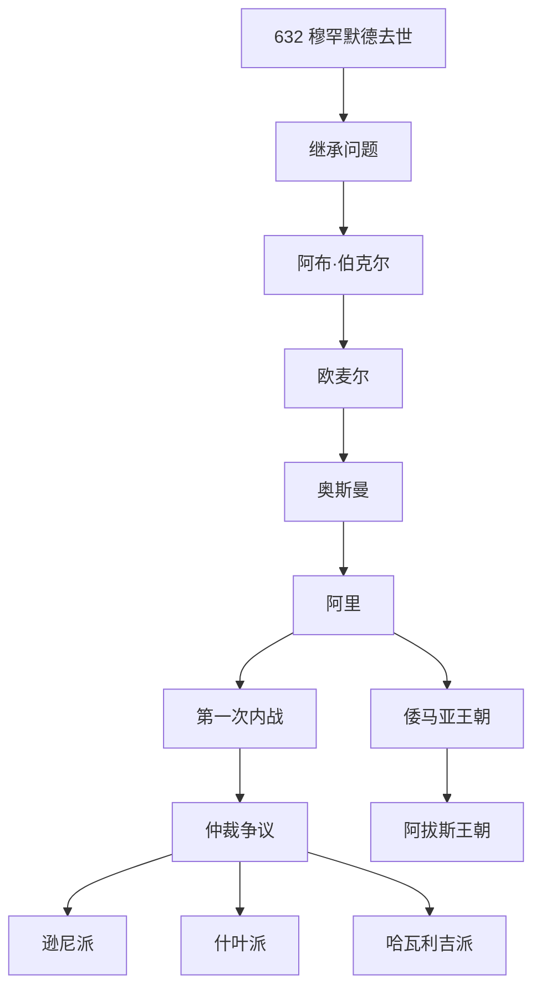

# 逊尼派与什叶派

## 时间

- 分歧起点：632 年穆罕默德去世后的继承问题
- 第一次内战：656-661 年
- 倭马亚王朝：661-750 年
- 阿拔斯王朝：750-1258 年

## 概括

逊尼派与什叶派的分歧最初围绕穆罕默德去世后的共同体领导权展开，随后叠加政治冲突、王朝更替、法学传统和神学解释，逐渐发展为伊斯兰教内部最重要的两大传统。

## 演变关系

## 分歧主线

| 维度 | 逊尼派 | 什叶派 |
|---|---|---|
| 领导权理解 | 哈里发可由共同体认可或推选产生 | 阿里及其后裔具有特殊合法性 |
| 权威重心 | 圣行、圣训、法学学派和共同体共识 | 伊玛目权威、家族血统和宗教解释权 |
| 历史记忆 | 承认前四任哈里发为正统哈里发 | 对阿里及其后裔受压制的记忆更突出 |
| 人口比例 | 约占多数 | 约占少数，在伊朗、伊拉克、黎巴嫩等地影响较大 |

## 说明

- 穆罕默德没有留下被所有派别共同接受的继承制度，继承问题因此兼具政治和宗教意义。
- 阿布·伯克尔、欧麦尔、奥斯曼和阿里后来被逊尼派视为四大正统哈里发；什叶派则强调阿里及其后裔的合法性。
- 奥斯曼遇刺后，阿里继任并面对穆阿维叶等反对力量，双方冲突引发第一次内战。
- 隋芬战役后的仲裁争议导致部分阿里支持者脱离，形成哈瓦利吉派；强调阿里家族合法性的一支逐渐演变为什叶派。
- 倭马亚王朝和阿拔斯王朝的更替，使早期继承争议与王朝政治、地区利益和宗教权威进一步交织。
- 现代逊尼派与什叶派差异不仅是“谁继承穆罕默德”的问题，也包含法学、礼仪、圣徒和宗教权威结构的长期分化。

## 原始图示

## 上级

- [伊斯兰教](/%E4%BA%BA%E6%96%87%E7%A7%91%E5%AD%A6/%E5%AE%97%E6%95%99/%E4%BA%9A%E4%BC%AF%E6%8B%89%E7%BD%95%E8%AF%B8%E6%95%99/%E4%BC%8A%E6%96%AF%E5%85%B0%E6%95%99/README.md)
