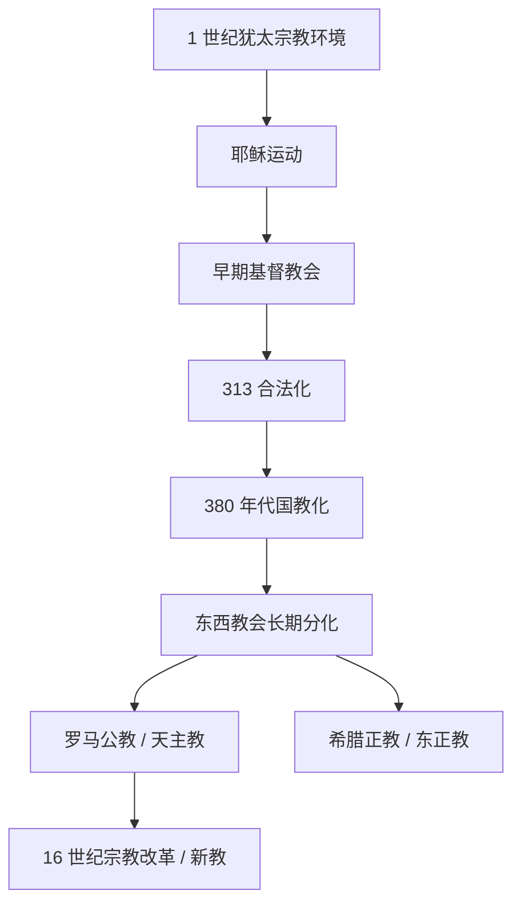

# 基督教

## 时间

- 兴起：公元 1 世纪
- 成为罗马帝国合法宗教：313 年《米兰敕令》后
- 成为罗马帝国国教：380 年代逐步确立

## 概括

基督教起源于公元 1 世纪巴勒斯坦地区的犹太宗教环境，以耶稣为基督和救主为核心信仰。早期基督教在罗马帝国境内传播，经历迫害、合法化、国教化、东西教会分化和宗教改革，形成天主教、东正教、新教等主要传统。

## 演变关系

## 说明

- 早期罗马帝国宗教环境较多元，但基督教因拒绝皇帝神性、批评偶像崇拜、组织独立共同体等原因，曾多次受到官方或地方层面的压制。
- 君士坦丁一世在 313 年承认基督教合法，基督教随后逐渐成为帝国政治合法性和社会整合的重要资源。
- 罗马帝国东西部在语言、文化、行政结构和神学传统上差异明显，教会也逐渐形成以罗马为中心的西方传统和以君士坦丁堡等教区为中心的东方传统。
- 1054 年东西教会互相绝罚通常被视为“大分裂”的标志，但双方差异和冲突在此前已经长期积累。
- 16 世纪宗教改革反对赎罪券和教会权威滥用，并推动新教传统形成；新教内部又分化出路德宗、改革宗、安立甘宗等宗派。

## 主要分支

| 分支 | 形成背景 | 特点 |
|---|---|---|
| 天主教 | 西方拉丁教会传统，以罗马主教权威为核心 | 重视教宗、教会圣统制和七件圣事传统 |
| 东正教 | 东方希腊教会传统，受拜占庭文化影响较深 | 重视主教会议、礼仪传统和教父神学 |
| 新教 | 16 世纪宗教改革后形成 | 强调圣经权威、因信称义等原则；宗派众多 |

## 原始图示

## 上级

- [亚伯拉罕诸教](/%E4%BA%BA%E6%96%87%E7%A7%91%E5%AD%A6/%E5%AE%97%E6%95%99/%E4%BA%9A%E4%BC%AF%E6%8B%89%E7%BD%95%E8%AF%B8%E6%95%99/README.md)
