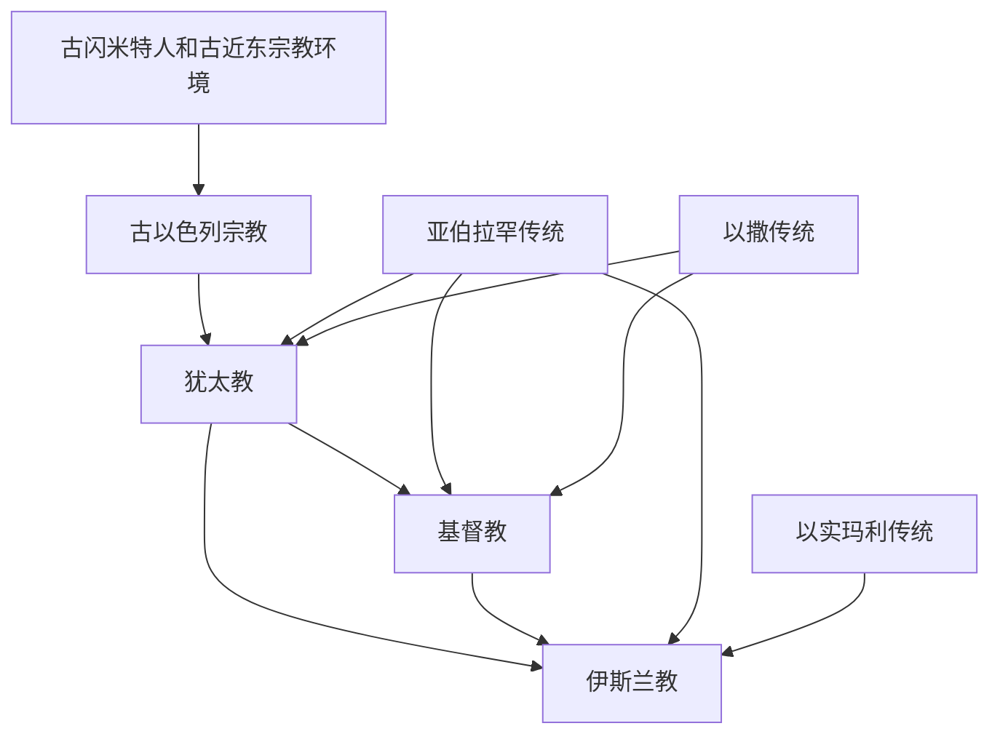

# 起源与相互关系

## 概括

犹太教、基督教和伊斯兰教都与古代近东的一神信仰传统有关，但不是简单的直线继承。犹太教形成较早，基督教从 1 世纪犹太宗教环境中分化出来，伊斯兰教在 7 世纪阿拉伯半岛兴起，并吸收、重述了犹太教和基督教的若干人物与叙事。

## 演变关系

## 共同点

- 都强调唯一神，反对把普通神灵、偶像或自然力量置于最高神位置。
- 都保存先知传统，并把亚伯拉罕视为重要的信仰祖先。
- 都拥有经典传统，并把经典解释、律法或教义权威作为共同体边界的一部分。

## 关键差异

| 问题 | 犹太教 | 基督教 | 伊斯兰教 |
|---|---|---|---|
| 耶稣身份 | 一般不承认耶稣为弥赛亚或先知 | 认耶稣为基督、救主；主流教义认其为圣子 | 认耶稣为先知，不认其为神子或救主 |
| 穆罕默德身份 | 不承认其先知地位 | 不承认其先知地位 | 认其为最后的先知 |
| 核心经典 | 《希伯来圣经》及拉比传统 | 《旧约》《新约》 | 《古兰经》及圣训传统 |
| 共同体边界 | 律法、族群记忆、会堂与拉比传统 | 洗礼、教会、信经和圣礼传统 | 信仰告白、五功、乌玛和法学传统 |

## 经典关系

- 基督教继承并重新解释犹太教经典，把《希伯来圣经》纳入《旧约》，并以《新约》解释耶稣及早期教会传统。
- 伊斯兰教承认部分早期启示传统，但认为《古兰经》是最终、完整的启示；因此它与犹太教、基督教共享若干人物叙事，却不接受两者的全部神学解释。
- “共同先知”不等于“相互承认教义”：三教共享部分人物和叙事，但对启示、救赎、律法和共同体权威的理解不同。

## 原始图示

## 上级

- [亚伯拉罕诸教](/%E4%BA%BA%E6%96%87%E7%A7%91%E5%AD%A6/%E5%AE%97%E6%95%99/%E4%BA%9A%E4%BC%AF%E6%8B%89%E7%BD%95%E8%AF%B8%E6%95%99/README.md)
