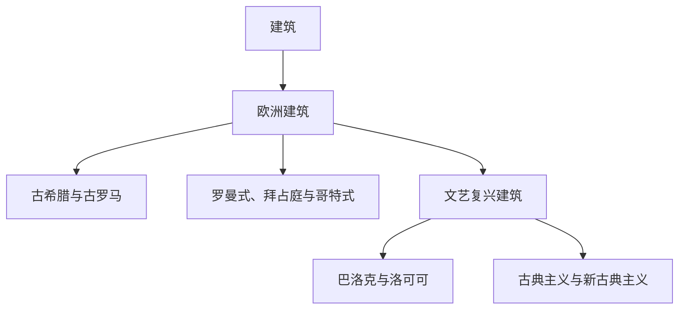

# 建筑

## 概括

本目录用于整理建筑历史、地域传统、风格演变、结构技术和视觉辨识。建筑笔记既要说明时间与地域背景，也要区分平面组织、承重方式、拱券与穹顶、柱式、立面、采光和装饰等具体特征。

当前已系统整理欧洲建筑，从古希腊、古罗马，经罗曼式、拜占庭和哥特式，到文艺复兴、巴洛克、洛可可、古典主义和新古典主义。其他地域建筑可在后续按相同原则建立独立目录。

## 目录结构

## 区域入口

| 区域 | 入口 | 当前内容 |
|---|---|---|
| 欧洲建筑 | [欧洲建筑](/%E4%BA%BA%E6%96%87%E7%A7%91%E5%AD%A6/%E5%BB%BA%E7%AD%91/%E6%AC%A7%E6%B4%B2%E5%BB%BA%E7%AD%91/README.md) | 古典建筑、中世纪教堂、文艺复兴及近代欧洲风格演变 |

## 阅读方法

- 先确认建筑的建造年代、地域、用途和宗教或政治背景，再判断风格。
- 同时观察平面、结构、材料、立面和装饰，不只依靠单一外观特征。
- 区分历史原型与后世复兴，例如古希腊、古罗马建筑与新古典主义建筑。
- 风格之间常有并存、传播和地方变体，演变图表示主要关系，不代表整齐替代。

## 相关入口

- 上级：[人文科学](/%E4%BA%BA%E6%96%87%E7%A7%91%E5%AD%A6/README.md)
- 历史背景：[历史](/%E4%BA%BA%E6%96%87%E7%A7%91%E5%AD%A6/%E5%8E%86%E5%8F%B2/README.md)
