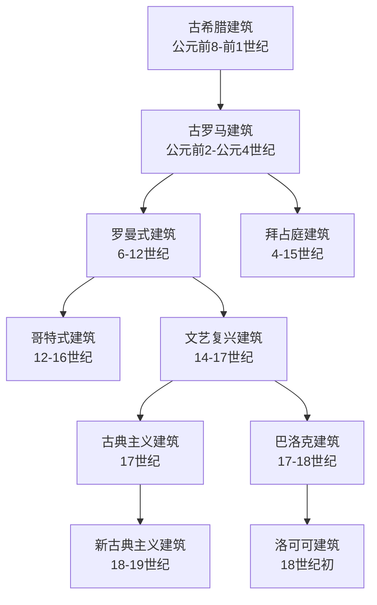

# 欧洲建筑概括与总览

这页是 `人文科学/建筑/欧洲建筑` 目录的总览入口。阅读时可以先抓住两条主线：一条是从古希腊、古罗马到中世纪教堂，再到文艺复兴以后不断“复兴古典”的时间线；另一条是建筑外观的辨识线索，包括柱式、拱券、穹顶、十字平面、尖顶、彩窗、曲线装饰和规则对称。

## 目录导航

- [古希腊建筑](%E5%8F%A4%E5%B8%8C%E8%85%8A%E5%BB%BA%E7%AD%91.md)：欧洲建筑源头，以神殿、矩形地基、廊柱、三角形山墙为核心。
- [古罗马建筑](%E5%8F%A4%E7%BD%97%E9%A9%AC%E5%BB%BA%E7%AD%91.md)：继承古希腊柱式，并突出圆形拱券、穹顶和混凝土技术。
- [罗曼式建筑](%E7%BD%97%E6%9B%BC%E5%BC%8F%E5%BB%BA%E7%AD%91.md)：10-12世纪的罗马风教堂，厚墙、小窗、圆拱和拉丁十字平面明显。
- [拜占庭建筑](%E6%8B%9C%E5%8D%A0%E5%BA%AD%E5%BB%BA%E7%AD%91.md)：东罗马和东正教传统，常见希腊十字、集中式空间、多个穹顶或洋葱头。
- [哥特式建筑](%E5%93%A5%E7%89%B9%E5%BC%8F%E5%BB%BA%E7%AD%91.md)：由罗曼式演化而来，以尖顶、扶壁、彩窗和强烈上升感为代表。
- [文艺复兴建筑](%E6%96%87%E8%89%BA%E5%A4%8D%E5%85%B4%E5%BB%BA%E7%AD%91.md)：反哥特、复兴古罗马，重视严谨构图、柱式系统和穹顶。
- [巴洛克建筑](%E5%B7%B4%E6%B4%9B%E5%85%8B%E5%BB%BA%E7%AD%91.md)：从文艺复兴发展而来，追求动态、曲线、不规则和富丽装饰。
- [洛可可建筑](%E6%B4%9B%E5%8F%AF%E5%8F%AF%E5%BB%BA%E7%AD%91.md)：可看作巴洛克装饰性的继续放大，偏轻巧、繁复、自然形态和植物感。
- [古典主义建筑](%E5%8F%A4%E5%85%B8%E4%B8%BB%E4%B9%89%E5%BB%BA%E7%AD%91.md)：强调规则、轴线、对称、比例和主从关系，狭义上常指法国古典主义。
- [新古典主义建筑](%E6%96%B0%E5%8F%A4%E5%85%B8%E4%B8%BB%E4%B9%89%E5%BB%BA%E7%AD%91.md)：重新模仿古希腊、古罗马，构图规整，常见古典柱式和纪念性体量。

## 时间线主线

| 时段 / 脉络 | 风格 | 核心变化 |
| --- | --- | --- |
| 古代源头 | 古希腊、古罗马 | 古希腊提供柱式和神殿母题；古罗马发展拱券、穹顶和大型公共建筑技术。 |
| 中世纪教堂 | 罗曼式、拜占庭、哥特式 | 罗曼式偏厚重和圆拱；拜占庭偏集中式穹顶；哥特式把结构和视觉都推向尖顶、彩窗和垂直上升。 |
| 文艺复兴以后 | 文艺复兴、巴洛克、洛可可 | 文艺复兴回到古典秩序；巴洛克转向动态和奢华；洛可可进一步走向繁复、轻巧和自然形态装饰。 |
| 近代复古 | 古典主义、新古典主义 | 古典主义用规则和对称反制巴洛克浮夸；新古典主义更直接地复兴、模仿古希腊和古罗马。 |

## 快速辨识

| 风格 | 快速判断线索 | 容易混淆点 |
| --- | --- | --- |
| 古希腊 | “古”的，廊柱，三角形山墙 | 后世很多建筑会借古希腊外观；关键看是否真是古希腊时期与地域。 |
| 古罗马 | “古”的，圆形拱券、穹顶 | 后世凯旋门、万神庙式建筑常是借鉴；关键仍是时间和地点。 |
| 罗曼式 | 拉丁十字基，圆形穹顶，拱券，柱子，开窗小 | 与古罗马都用圆拱；与哥特式有过渡关系，需看年代、厚墙小窗和圆形元素。 |
| 拜占庭 | 希腊十字基，多个圆形穹顶或洋葱头 | 与罗曼式都可能有穹顶；拜占庭更偏集中式、方正、东正教传统。 |
| 哥特式 | 无圆形穹顶，很多尖顶，少墙面，多彩窗 | 罗曼式晚期也可能有尖塔；哥特式整体更强烈地向上、尖锐、透光。 |
| 文艺复兴 | 穹顶、柱子 | 这个容易和罗曼式和古典主义混淆，需要参考建筑时间。 |
| 巴洛克 | 不规则，曲线，装饰奢华，土豪金 | 与洛可可都奢华繁复；巴洛克更强调动态、曲面和戏剧性。 |
| 洛可可 | 装饰奢华夸张，像长满植物 | 可理解为巴洛克装饰性的进一步轻巧化、自然化。 |
| 古典主义 | 规则、对称、柱式 | 广义上可能和文艺复兴重叠；狭义常指法国古典主义。 |
| 新古典主义 | 规则、柱式，长得像古罗马古希腊 | 与真正的古希腊、古罗马最容易混；关键是“新”，即后世复兴或模仿。 |

## 阅读建议

1. 先读古希腊和古罗马，建立“古典源头”的基本形状：柱式、山墙、拱券、穹顶。
2. 再读罗曼式、拜占庭、哥特式，比较中世纪教堂在平面、承重、采光和顶部形态上的差异。
3. 最后读文艺复兴、巴洛克、洛可可、古典主义、新古典主义，重点看后世如何反复回到古典、反对前一阶段，或把装饰推向极端。
4. 判断具体建筑时，不只看“长得像什么”，还要看建造年代、地域和用途；古希腊 / 古罗马与新古典主义尤其需要用时间来区分。
