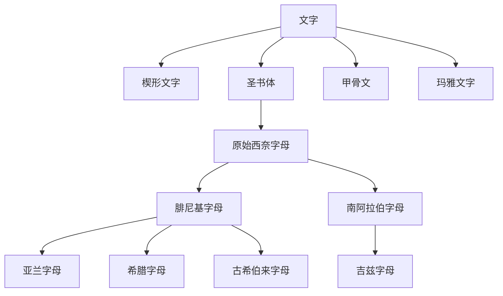

# 文字

文字是把语言、数量、名称、仪式和政治记录固定下来的符号系统。人类历史上有少数书写传统通常被视为自源文字：它们不是简单借用已有文字，而是在本地社会需求中形成可记录语言的系统。

## 四大自源文字

| 文字 | 大致出现时间 | 地区 | 类型 | 简要概括 |
|---|---:|---|---|---|
| [楔形文字](/%E4%BA%BA%E6%96%87%E7%A7%91%E5%AD%A6/%E6%96%87%E5%AD%97/%E6%A5%94%E5%BD%A2%E6%96%87%E5%AD%97/README.md) | 约前3400-前3000年 | 两河流域 | 由图画、语标、音节符号发展而成 | 最早成熟文字传统之一，先服务于会计和行政，后用于苏美尔语、阿卡德语、赫梯语等。 |
| [圣书体](/%E4%BA%BA%E6%96%87%E7%A7%91%E5%AD%A6/%E6%96%87%E5%AD%97/%E5%9C%A3%E4%B9%A6%E4%BD%93/README.md) | 约前3200年 | 古埃及 | 语标、表音符号、限定符混合 | 古埃及正式铭刻体系，后来间接启发原始西奈字母，成为多数音素字母谱系的重要源头。 |
| [甲骨文](/%E4%BA%BA%E6%96%87%E7%A7%91%E5%AD%A6/%E6%96%87%E5%AD%97/%E7%94%B2%E9%AA%A8%E6%96%87/README.md) | 约前13世纪 | 中国商代晚期 | 汉字早期形态，语素-音节文字 | 目前已知成体系的最早汉字材料，记录占卜、祭祀、战争、田猎和王室事务。 |
| [玛雅文字](/%E4%BA%BA%E6%96%87%E7%A7%91%E5%AD%A6/%E6%96%87%E5%AD%97/%E7%8E%9B%E9%9B%85%E6%96%87%E5%AD%97/README.md) | 至少前3-前2世纪 | 中美洲玛雅地区 | 语标-音节文字 | 前哥伦布时代美洲最充分释读的文字体系，用于纪年、王权、仪式和历史叙事。 |

## 易混点

- “象形”只是早期字形来源或造字方式之一，不等于一个文字系统只能表意。圣书体、楔形文字和玛雅文字都包含表音成分。
- “字母”不是所有文字的共同起点。字母传统主要在圣书体影响下经原始西奈字母、腓尼基字母等路径扩散。
- 甲骨文不是中国最早可能存在的符号，但它是目前可确认、成体系、能记录语言的早期汉字材料。

