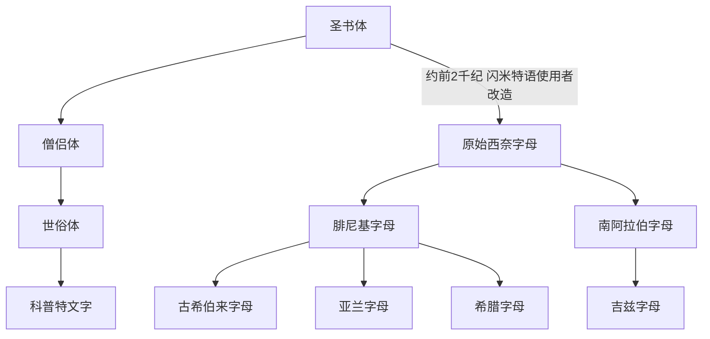

# 圣书体

## 时间

约前3200年起出现，古埃及王朝时代长期使用；古典晚期以后，随着古埃及宗教体系衰落，读写传统逐渐中断。

## 概括

圣书体是古埃及用于纪念碑、神庙、墓葬和正式铭刻的文字体系。它不是单纯“图画文字”，而是由语标、单辅音/多辅音表音符号和限定符共同组成的复杂系统。

圣书体本身主要服务于古埃及语；它对世界文字史的最大外溢影响，是闪米特语使用者借用部分埃及图形并按自身语言重新赋值，形成原始西奈字母，随后发展出腓尼基、希伯来、亚兰、希腊、拉丁、阿拉伯、婆罗米等庞大字母谱系。

## 演变关系

## 子系统

| 名称 | 关系 | 简要说明 |
|---|---|---|
| [原始西奈字母](/%E4%BA%BA%E6%96%87%E7%A7%91%E5%AD%A6/%E6%96%87%E5%AD%97/%E5%9C%A3%E4%B9%A6%E4%BD%93/%E5%8E%9F%E5%A7%8B%E8%A5%BF%E5%A5%88%E5%AD%97%E6%AF%8D/README.md) | 受圣书体图形启发的字母化改造 | 多数后世音素字母谱系的上游。 |
| 僧侣体 | 圣书体的草写/实用书写形态 | 多用于纸草、行政和宗教文书。 |
| 世俗体 | 僧侣体继续草化后的通行文字 | 晚期埃及日常文书常用。 |
| 科普特文字 | 用希腊字母加若干埃及文字来源字母书写埃及语 | 不属于圣书体的直接字形延续，但保留了晚期埃及语书面传统。 |

## 说明

- 圣书体的“圣”来自希腊语传统中的“神圣镌刻”，指其常见于神庙和纪念性场景。
- 圣书体内部的表音符号可以表示一个、两个或三个辅音，限定符通常不发音，用来提示词义类别。
- 原始西奈字母不是圣书体的“简化版”，而是把埃及图像符号重新解释为闪米特语辅音的创新系统。

