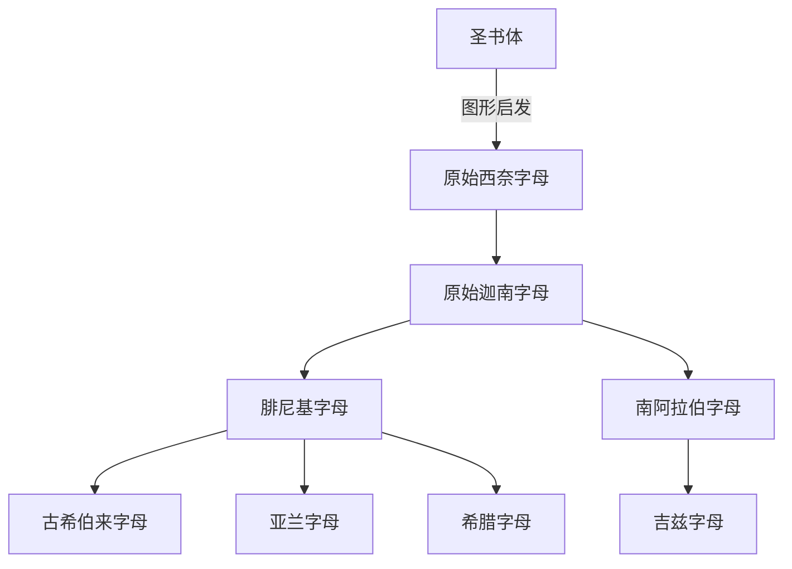

# 原始西奈字母

## 时间

约前19世纪至前16世纪之间形成，材料主要与西奈半岛、迦南及埃及影响圈有关。

## 概括

原始西奈字母是早期闪米特语使用者在埃及圣书体图形影响下创造的辅音字母体系。它的创新不在于照搬埃及文字，而在于用少量符号按闪米特语词首音或相关读音表示辅音，从而把复杂的图像符号改造成更抽象的音素书写。

它通常被视为腓尼基字母、古希伯来字母、南阿拉伯字母，以及后续希腊、拉丁、亚兰、阿拉伯、婆罗米等大量字母传统的关键上游。

## 演变关系

## 子系统

| 名称 | 关系 | 简要说明 |
|---|---|---|
| [腓尼基字母](/%E4%BA%BA%E6%96%87%E7%A7%91%E5%AD%A6/%E6%96%87%E5%AD%97/%E5%9C%A3%E4%B9%A6%E4%BD%93/%E5%8E%9F%E5%A7%8B%E8%A5%BF%E5%A5%88%E5%AD%97%E6%AF%8D/%E8%85%93%E5%B0%BC%E5%9F%BA%E5%AD%97%E6%AF%8D/README.md) | 原始迦南字母的标准化分支 | 地中海字母扩散的核心中介。 |
| [南阿拉伯字母](/%E4%BA%BA%E6%96%87%E7%A7%91%E5%AD%A6/%E6%96%87%E5%AD%97/%E5%9C%A3%E4%B9%A6%E4%BD%93/%E5%8E%9F%E5%A7%8B%E8%A5%BF%E5%A5%88%E5%AD%97%E6%AF%8D/%E5%8D%97%E9%98%BF%E6%8B%89%E4%BC%AF%E5%AD%97%E6%AF%8D/README.md) | 南闪米特分支 | 通行于古代南阿拉伯，后影响吉兹字母。 |

## 说明

- 原始西奈字母更准确地说是辅音字母或音素文字，不标元音或很少标元音。
- “原始西奈字母直接产生所有现代字母”过于简化；中间至少经过原始迦南、腓尼基、亚兰、希腊、婆罗米等多条中介路径。
- 古希伯来字母一般应放在腓尼基/迦南字母分支下，而不是与原始西奈字母并列为圣书体的直接子系统。

## 上级

- [圣书体](/%E4%BA%BA%E6%96%87%E7%A7%91%E5%AD%A6/%E6%96%87%E5%AD%97/%E5%9C%A3%E4%B9%A6%E4%BD%93/README.md)

