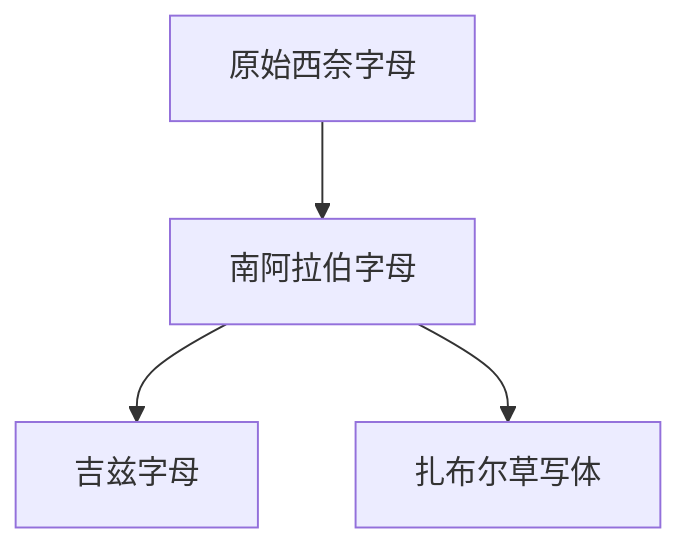

# 南阿拉伯字母

## 时间

约前9世纪起见于古代南阿拉伯，主要用于也门及阿拉伯半岛南部的古南阿拉伯诸语言。

## 概括

南阿拉伯字母又称古南阿拉伯字母、穆斯纳德文字，是原始西奈字母传统在南闪米特世界中的重要分支。它用于书写古南阿拉伯语诸语言，并通过红海两岸交流影响非洲之角的吉兹字母。

## 演变关系

## 子系统

| 名称 | 关系 | 简要说明 |
|---|---|---|
| [吉兹字母](/%E4%BA%BA%E6%96%87%E7%A7%91%E5%AD%A6/%E6%96%87%E5%AD%97/%E5%9C%A3%E4%B9%A6%E4%BD%93/%E5%8E%9F%E5%A7%8B%E8%A5%BF%E5%A5%88%E5%AD%97%E6%AF%8D/%E5%8D%97%E9%98%BF%E6%8B%89%E4%BC%AF%E5%AD%97%E6%AF%8D/%E5%90%89%E5%85%B9%E5%AD%97%E6%AF%8D/README.md) | 后继分支 | 埃塞俄比亚和厄立特里亚文字传统的重要来源。 |
| 扎布尔草写体 | 同一传统的草写/日用分支 | 常见于木棍等媒介上的日常书写。 |

## 说明

- 南阿拉伯字母与腓尼基字母同属原始西奈字母传统的后继，不宜简单写成“腓尼基字母的子系统”。
- 它通常是辅音字母，书写方向和字形在不同材料中有变化。
- 吉兹字母从南阿拉伯字母发展而来后，又形成带元音标记的音节性字母系统。

## 上级

- [原始西奈字母](/%E4%BA%BA%E6%96%87%E7%A7%91%E5%AD%A6/%E6%96%87%E5%AD%97/%E5%9C%A3%E4%B9%A6%E4%BD%93/%E5%8E%9F%E5%A7%8B%E8%A5%BF%E5%A5%88%E5%AD%97%E6%AF%8D/README.md)

