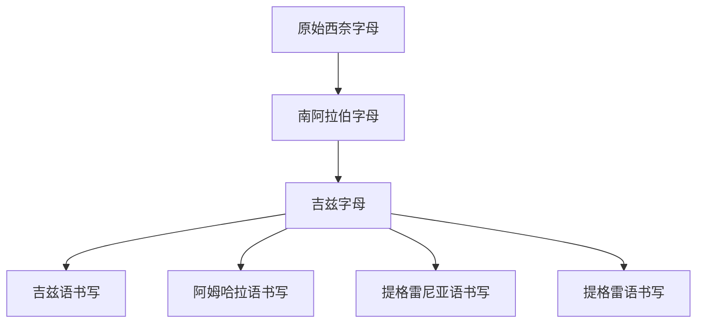

# 吉兹字母

## 时间

约公元前后至公元早期在非洲之角形成并发展；后来用于吉兹语、阿姆哈拉语、提格雷尼亚语等埃塞俄比亚和厄立特里亚语言。

## 概括

吉兹字母又称埃塞俄比亚字母、埃塞俄比亚音节文字，来源通常追溯到古南阿拉伯字母。早期吉兹书写接近辅音字母，后来发展出按辅音加元音组合排列的元音化系统，常被称为元音附标音节文字或 abugida。

## 演变关系

## 说明

- 吉兹字母不是圣书体的直接子系统，而是经原始西奈字母、南阿拉伯字母间接进入红海西岸。
- 它的重要变化是从辅音字母向带元音等级的音节性系统发展。
- 今天“吉兹字母”常泛指埃塞俄比亚文字体系，不只限于古典吉兹语。

## 上级

- [南阿拉伯字母](/%E4%BA%BA%E6%96%87%E7%A7%91%E5%AD%A6/%E6%96%87%E5%AD%97/%E5%9C%A3%E4%B9%A6%E4%BD%93/%E5%8E%9F%E5%A7%8B%E8%A5%BF%E5%A5%88%E5%AD%97%E6%AF%8D/%E5%8D%97%E9%98%BF%E6%8B%89%E4%BC%AF%E5%AD%97%E6%AF%8D/README.md)

## 参考资料

- [吉兹字母 - 维基百科](https://zh.wikipedia.org/wiki/%E5%90%89%E8%8C%B2%E5%AD%97%E6%AF%8D)
- [Omniglot: Ge'ez script](https://www.omniglot.com/writing/ethiopic.htm)
