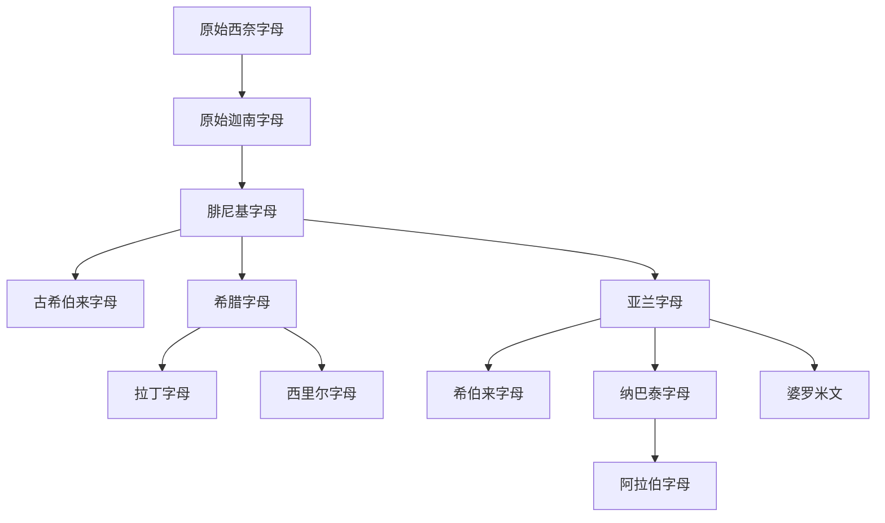

# 腓尼基字母

## 时间

约前11世纪起成熟并广泛使用，通行于黎凡特沿岸和腓尼基贸易网络，后由多种后继文字取代或吸收。

## 概括

腓尼基字母是早期北闪米特辅音字母的标准化形态，通常包含22个辅音字母，从右向左书写。它的历史影响极大：地中海、西亚、欧洲、北非和南亚许多文字谱系都可经由腓尼基或其近亲分支追溯到原始西奈字母传统。

## 演变关系

## 子系统

| 名称 | 关系 | 简要说明 |
|---|---|---|
| [古希伯来字母](/%E4%BA%BA%E6%96%87%E7%A7%91%E5%AD%A6/%E6%96%87%E5%AD%97/%E5%9C%A3%E4%B9%A6%E4%BD%93/%E5%8E%9F%E5%A7%8B%E8%A5%BF%E5%A5%88%E5%AD%97%E6%AF%8D/%E8%85%93%E5%B0%BC%E5%9F%BA%E5%AD%97%E6%AF%8D/%E5%8F%A4%E5%B8%8C%E4%BC%AF%E6%9D%A5%E5%AD%97%E6%AF%8D/README.md) | 近亲/派生分支 | 用于早期希伯来语，后保留于撒马利亚字母传统。 |
| [亚兰字母](/%E4%BA%BA%E6%96%87%E7%A7%91%E5%AD%A6/%E6%96%87%E5%AD%97/%E5%9C%A3%E4%B9%A6%E4%BD%93/%E5%8E%9F%E5%A7%8B%E8%A5%BF%E5%A5%88%E5%AD%97%E6%AF%8D/%E8%85%93%E5%B0%BC%E5%9F%BA%E5%AD%97%E6%AF%8D/%E4%BA%9A%E5%85%B0%E5%AD%97%E6%AF%8D/README.md) | 东向扩散核心分支 | 影响希伯来、叙利亚、纳巴泰、阿拉伯、婆罗米等文字。 |
| [希腊字母](/%E4%BA%BA%E6%96%87%E7%A7%91%E5%AD%A6/%E6%96%87%E5%AD%97/%E5%9C%A3%E4%B9%A6%E4%BD%93/%E5%8E%9F%E5%A7%8B%E8%A5%BF%E5%A5%88%E5%AD%97%E6%AF%8D/%E8%85%93%E5%B0%BC%E5%9F%BA%E5%AD%97%E6%AF%8D/%E5%B8%8C%E8%85%8A%E5%AD%97%E6%AF%8D/README.md) | 西向扩散核心分支 | 明确加入元音字母，影响拉丁、西里尔等文字。 |
| 伊比利亚文字 | 受腓尼基、希腊等地中海书写影响 | 古伊比利亚半岛若干古文字的统称，谱系关系复杂。 |

## 说明

- 腓尼基字母本身通常不标元音，因此更接近辅音字母。
- 希腊字母的重要创新是把部分腓尼基辅音字母重新用于元音，使字母体系更适合记录希腊语。
- 婆罗米文是否经由亚兰字母影响仍有学术讨论；整理谱系时可列为“可能受亚兰影响的重要分支”，不宜写成完全无争议的直系继承。

## 上级

- [原始西奈字母](/%E4%BA%BA%E6%96%87%E7%A7%91%E5%AD%A6/%E6%96%87%E5%AD%97/%E5%9C%A3%E4%B9%A6%E4%BD%93/%E5%8E%9F%E5%A7%8B%E8%A5%BF%E5%A5%88%E5%AD%97%E6%AF%8D/README.md)

