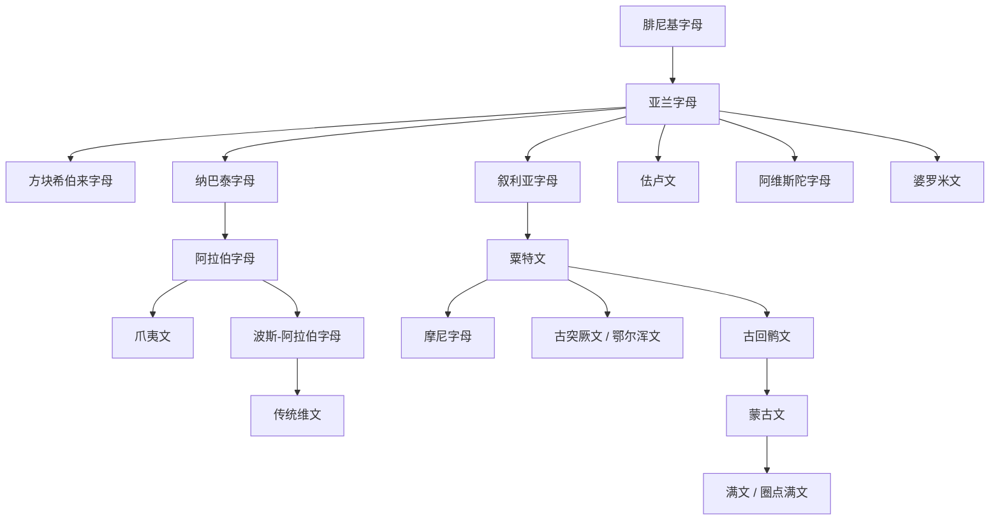

# 亚兰字母

## 时间

约前8世纪起使用并扩散；阿契美尼德波斯帝国时期成为近东重要行政文字传统。

## 概括

亚兰字母是从腓尼基字母发展出的辅音字母，用于书写亚兰语。由于亚兰语在新亚述、新巴比伦和波斯帝国时期具有广泛通用语地位，亚兰字母向西亚、中亚、南亚和东亚边缘传播，成为多条文字谱系的中介。

## 演变关系

## 说明

- 亚兰字母的影响不只来自字形，还来自帝国行政、商业和宗教传播网络。
- 阿拉伯字母通常经纳巴泰字母追溯到亚兰字母。
- 叙利亚字母、粟特文、古回鹘文、蒙古文、满文构成一条横跨西亚、中亚到东亚的文字传播链。
- 婆罗米文与亚兰字母的关系存在争议，常见观点认为至少可能受到亚兰字母启发；整理时应保留“可能影响”这一谨慎表述。

## 上级

- [腓尼基字母](/%E4%BA%BA%E6%96%87%E7%A7%91%E5%AD%A6/%E6%96%87%E5%AD%97/%E5%9C%A3%E4%B9%A6%E4%BD%93/%E5%8E%9F%E5%A7%8B%E8%A5%BF%E5%A5%88%E5%AD%97%E6%AF%8D/%E8%85%93%E5%B0%BC%E5%9F%BA%E5%AD%97%E6%AF%8D/README.md)

