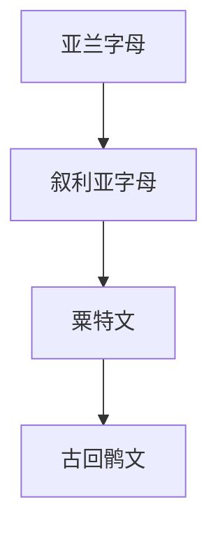

# 叙利亚字母

## 概括

叙利亚字母是亚兰字母的后继分支，主要用于书写叙利亚语，并通过基督教、商贸和中亚交通影响更东部的文字传统。

## 演变关系

## 说明

- 叙利亚字母属于辅音字母传统，有不同书体分化。
- 它在中亚文字传播史中常作为亚兰传统东传的重要一环。

## 子系统

- [粟特文](/%E4%BA%BA%E6%96%87%E7%A7%91%E5%AD%A6/%E6%96%87%E5%AD%97/%E5%9C%A3%E4%B9%A6%E4%BD%93/%E5%8E%9F%E5%A7%8B%E8%A5%BF%E5%A5%88%E5%AD%97%E6%AF%8D/%E8%85%93%E5%B0%BC%E5%9F%BA%E5%AD%97%E6%AF%8D/%E4%BA%9A%E5%85%B0%E5%AD%97%E6%AF%8D/%E5%8F%99%E5%88%A9%E4%BA%9A%E5%AD%97%E6%AF%8D/%E7%B2%9F%E7%89%B9%E6%96%87/README.md)

## 参考资料

- [Syriac alphabet - Wikipedia](https://en.wikipedia.org/wiki/Syriac_alphabet)
- [Omniglot: Syriac](https://www.omniglot.com/writing/syriac.htm)
