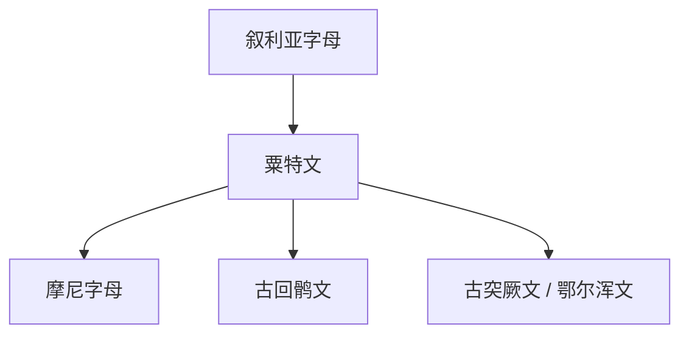

# 粟特文

## 概括

粟特文是中亚粟特人使用的文字，源自亚兰-叙利亚文字传统。随着粟特商贸网络和宗教传播，它影响了古回鹘文、摩尼字母等中亚文字。

## 演变关系

## 说明

- 粟特文通常从右向左书写，后期字形连写化明显。
- 古突厥文与粟特文的关系比古回鹘文更复杂，宜写为受影响或同区域互动，不宜简单视作直接子系统。

## 子系统

- [古回鹘文](/%E4%BA%BA%E6%96%87%E7%A7%91%E5%AD%A6/%E6%96%87%E5%AD%97/%E5%9C%A3%E4%B9%A6%E4%BD%93/%E5%8E%9F%E5%A7%8B%E8%A5%BF%E5%A5%88%E5%AD%97%E6%AF%8D/%E8%85%93%E5%B0%BC%E5%9F%BA%E5%AD%97%E6%AF%8D/%E4%BA%9A%E5%85%B0%E5%AD%97%E6%AF%8D/%E5%8F%99%E5%88%A9%E4%BA%9A%E5%AD%97%E6%AF%8D/%E7%B2%9F%E7%89%B9%E6%96%87/%E5%8F%A4%E5%9B%9E%E9%B9%98%E6%96%87/README.md)

## 参考资料

- [Sogdian alphabet - Wikipedia](https://en.wikipedia.org/wiki/Sogdian_alphabet)
- [Omniglot: Sogdian](https://www.omniglot.com/writing/sogdian.htm)
