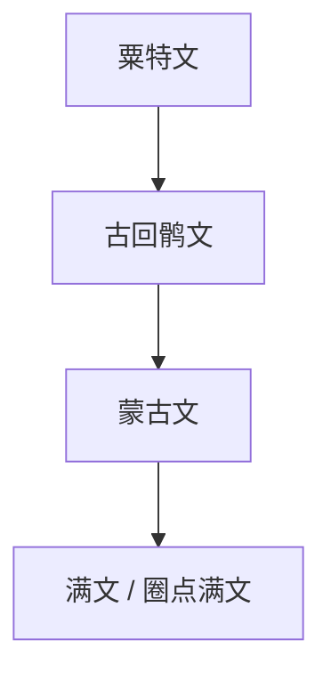

# 古回鹘文

## 概括

古回鹘文由粟特文发展而来，用于书写古回鹘语等突厥语文献。它后来影响蒙古文、满文等纵写文字传统。

## 演变关系

## 说明

- 古回鹘文原本承接从右向左书写的传统，后来在蒙古文等系统中转化为竖写形式。
- 现代“新维文”通常指拉丁化维吾尔文字方案；“传统维文”主要基于阿拉伯字母，两者不属于古回鹘文的直接延续。

## 子系统

- [蒙古文](/%E4%BA%BA%E6%96%87%E7%A7%91%E5%AD%A6/%E6%96%87%E5%AD%97/%E5%9C%A3%E4%B9%A6%E4%BD%93/%E5%8E%9F%E5%A7%8B%E8%A5%BF%E5%A5%88%E5%AD%97%E6%AF%8D/%E8%85%93%E5%B0%BC%E5%9F%BA%E5%AD%97%E6%AF%8D/%E4%BA%9A%E5%85%B0%E5%AD%97%E6%AF%8D/%E5%8F%99%E5%88%A9%E4%BA%9A%E5%AD%97%E6%AF%8D/%E7%B2%9F%E7%89%B9%E6%96%87/%E5%8F%A4%E5%9B%9E%E9%B9%98%E6%96%87/%E8%92%99%E5%8F%A4%E6%96%87/README.md)

## 参考资料

- [Old Uyghur alphabet - Wikipedia](https://en.wikipedia.org/wiki/Old_Uyghur_alphabet)
- [Omniglot: Old Uyghur](https://www.omniglot.com/writing/olduyghur.htm)
