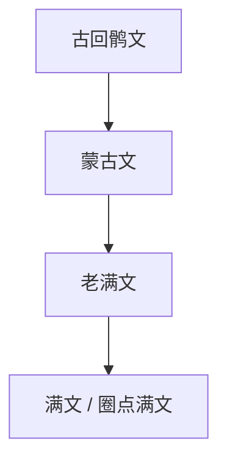

# 蒙古文

## 概括

传统蒙古文由古回鹘文发展而来，是竖写文字，字母形态随词首、词中、词末位置变化。它又影响满文、锡伯文等满洲-通古斯语族书写传统。

## 演变关系

## 说明

- 传统蒙古文不是西里尔蒙古文；后者是近现代在苏联影响下形成的蒙古语书写方案。
- 满文在蒙古文字母基础上增加圈点，以更清楚地区分满语音位。

## 参考资料

- [Mongolian script - Wikipedia](https://en.wikipedia.org/wiki/Mongolian_script)
- [Manchu alphabet - Wikipedia](https://en.wikipedia.org/wiki/Manchu_alphabet)
