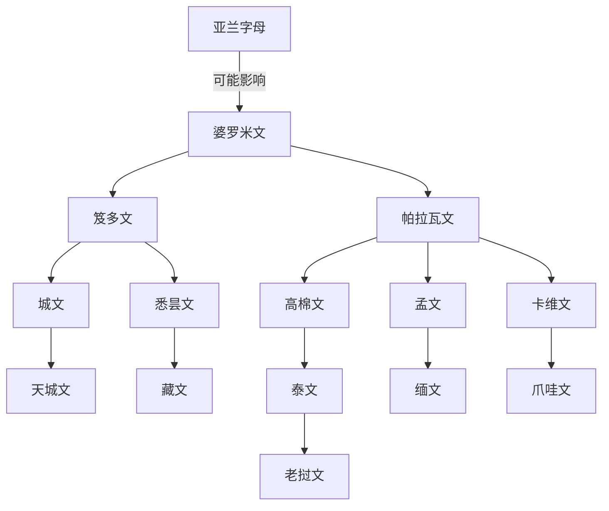

# 婆罗米文

## 概括

婆罗米文是南亚古代文字传统的核心源头之一，约前3世纪阿育王铭文中已经成熟。它与亚兰字母的关系存在讨论，常见观点认为其形成可能受到亚兰字母启发，但婆罗米文自身已发展为适合印度语言的元音附标音节文字。

## 演变关系

## 说明

- 婆罗米文不是辅音字母，而是每个基本字母带固有元音、再用附加符号改变元音的系统。
- 南亚、东南亚许多文字都可追溯到婆罗米系，但具体路径常涉及地方政权、宗教传播和书写材料变化。
- “梵文”是语言，不是文字；梵文可用天城文、悉昙文、夏拉达文等多种文字书写。

## 上级

- [亚兰字母](/%E4%BA%BA%E6%96%87%E7%A7%91%E5%AD%A6/%E6%96%87%E5%AD%97/%E5%9C%A3%E4%B9%A6%E4%BD%93/%E5%8E%9F%E5%A7%8B%E8%A5%BF%E5%A5%88%E5%AD%97%E6%AF%8D/%E8%85%93%E5%B0%BC%E5%9F%BA%E5%AD%97%E6%AF%8D/%E4%BA%9A%E5%85%B0%E5%AD%97%E6%AF%8D/README.md)

## 参考资料

- [Brahmi script - Wikipedia](https://en.wikipedia.org/wiki/Brahmi_script)
- [Omniglot: Brahmi](https://www.omniglot.com/writing/brahmi.htm)
