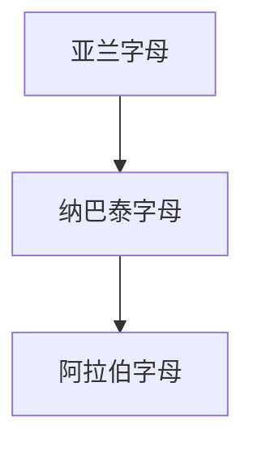

# 纳巴泰字母

## 概括

纳巴泰字母是亚兰字母的地方化分支，主要与纳巴泰王国和北阿拉伯地区有关。它的草写化字形是阿拉伯字母形成的重要中介。

## 演变关系

## 说明

- 纳巴泰字母保留亚兰字母的辅音字母性质。
- 后期纳巴泰书写越来越连笔化，形成早期阿拉伯字母的关键字形基础。

## 子系统

- [阿拉伯字母](/%E4%BA%BA%E6%96%87%E7%A7%91%E5%AD%A6/%E6%96%87%E5%AD%97/%E5%9C%A3%E4%B9%A6%E4%BD%93/%E5%8E%9F%E5%A7%8B%E8%A5%BF%E5%A5%88%E5%AD%97%E6%AF%8D/%E8%85%93%E5%B0%BC%E5%9F%BA%E5%AD%97%E6%AF%8D/%E4%BA%9A%E5%85%B0%E5%AD%97%E6%AF%8D/%E7%BA%B3%E5%B7%B4%E6%B3%B0%E5%AD%97%E6%AF%8D/%E9%98%BF%E6%8B%89%E4%BC%AF%E5%AD%97%E6%AF%8D/README.md)

