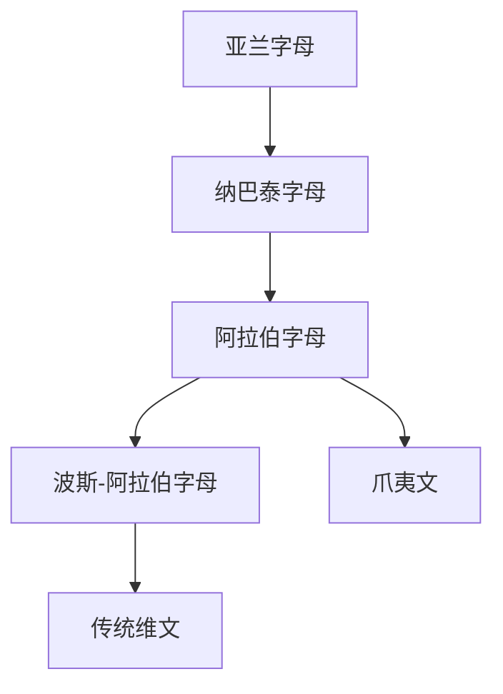

# 阿拉伯字母

## 概括

阿拉伯字母是由纳巴泰字母发展而来的辅音字母，后来通过伊斯兰文明、贸易和行政传播，成为西亚、北非、中亚、南亚和东南亚多种语言的重要书写系统。

## 演变关系

## 说明

- 阿拉伯字母基本书写方向为从右向左。
- 它可用附加点和附加字母适配非阿拉伯语音系，例如波斯语、乌尔都语、维吾尔语、马来语等。
- 元音可用附加符号标记，但日常书写常省略短元音。

## 参考资料

- [Arabic alphabet - Wikipedia](https://en.wikipedia.org/wiki/Arabic_alphabet)
- [Omniglot: Arabic alphabet](https://www.omniglot.com/writing/arabic.htm)
