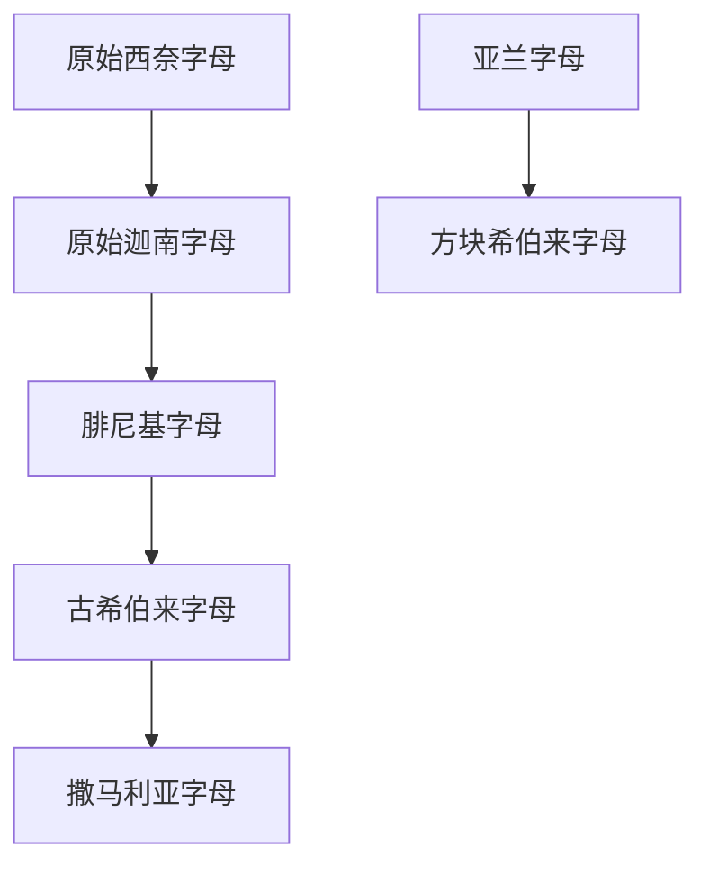

# 古希伯来字母

## 时间

约前10世纪至前2世纪使用；第二圣殿时期以后，犹太社群逐渐改用亚兰字母发展出的方块希伯来字母，古希伯来字母传统则在撒马利亚字母中延续。

## 概括

古希伯来字母又称古希伯来文、古希伯来书体，是早期希伯来语和以色列、犹大相关铭文使用的辅音字母。它与腓尼基字母关系很近，可视为迦南-腓尼基字母传统在希伯来语环境中的分支。

## 演变关系

## 说明

- 古希伯来字母和现代希伯来字母不是同一套字形。现代希伯来字母主要来自亚兰字母系统。
- 撒马利亚字母保留了古希伯来字母的若干字形传统。
- 古希伯来字母属于辅音字母，元音标记系统是后来的发展。

## 上级

- [腓尼基字母](/%E4%BA%BA%E6%96%87%E7%A7%91%E5%AD%A6/%E6%96%87%E5%AD%97/%E5%9C%A3%E4%B9%A6%E4%BD%93/%E5%8E%9F%E5%A7%8B%E8%A5%BF%E5%A5%88%E5%AD%97%E6%AF%8D/%E8%85%93%E5%B0%BC%E5%9F%BA%E5%AD%97%E6%AF%8D/README.md)

## 参考资料

- [Paleo-Hebrew alphabet - Wikipedia](https://en.wikipedia.org/wiki/Paleo-Hebrew_alphabet)
- [Omniglot: Ancient Hebrew scripts](https://www.omniglot.com/writing/ancienthebrew.htm)
