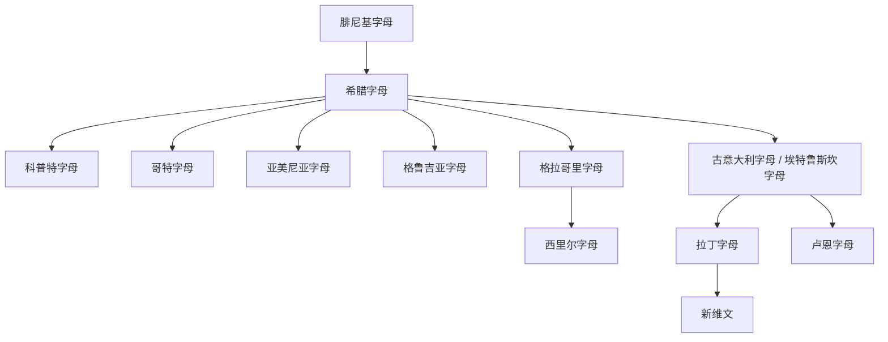

# 希腊字母

## 时间

约前9世纪至前8世纪由腓尼基字母改造而来，古典时代定型，并延续为现代希腊语文字。

## 概括

希腊字母是腓尼基字母西传后的关键改造。希腊语需要稳定表示元音，希腊人将若干腓尼基辅音字母改用于元音，由此形成更接近完整音素字母的体系。它是拉丁字母、西里尔字母、科普特字母等的重要上游。

## 演变关系

## 说明

- 希腊字母不是从圣书体直接发展而来，而是经原始西奈字母、原始迦南字母和腓尼基字母间接继承。
- 希腊字母最重要的制度性创新是系统表示元音。
- 拉丁字母通常经古意大利字母、尤其伊特鲁里亚字母传统间接来自希腊字母。
- 西里尔字母与格拉哥里字母、希腊字母和斯拉夫基督教书写传统关系密切。

## 上级

- [腓尼基字母](/%E4%BA%BA%E6%96%87%E7%A7%91%E5%AD%A6/%E6%96%87%E5%AD%97/%E5%9C%A3%E4%B9%A6%E4%BD%93/%E5%8E%9F%E5%A7%8B%E8%A5%BF%E5%A5%88%E5%AD%97%E6%AF%8D/%E8%85%93%E5%B0%BC%E5%9F%BA%E5%AD%97%E6%AF%8D/README.md)

