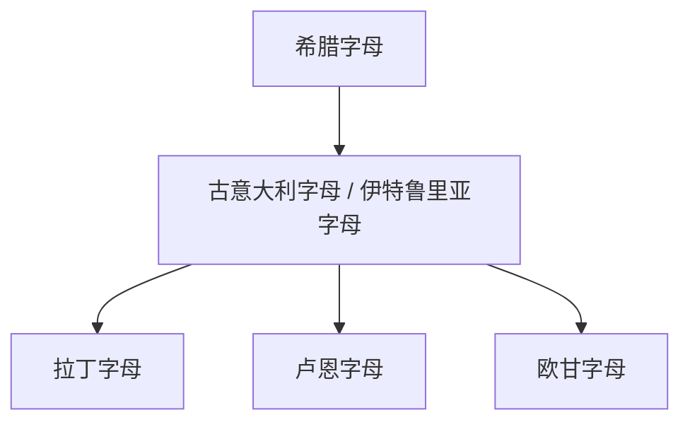

# 古意大利字母

## 概括

古意大利字母是古代意大利半岛若干文字的统称，受希腊字母影响形成，包括伊特鲁里亚字母等。拉丁字母通常经由这一传统发展出来。

## 演变关系

## 说明

- “古意大利字母”不是单一民族文字，而是一组相关文字传统。
- 拉丁字母的形成与伊特鲁里亚字母、中意大利地区语言和罗马早期书写实践有关。

## 子系统

- [拉丁字母](/%E4%BA%BA%E6%96%87%E7%A7%91%E5%AD%A6/%E6%96%87%E5%AD%97/%E5%9C%A3%E4%B9%A6%E4%BD%93/%E5%8E%9F%E5%A7%8B%E8%A5%BF%E5%A5%88%E5%AD%97%E6%AF%8D/%E8%85%93%E5%B0%BC%E5%9F%BA%E5%AD%97%E6%AF%8D/%E5%B8%8C%E8%85%8A%E5%AD%97%E6%AF%8D/%E5%8F%A4%E6%84%8F%E5%A4%A7%E5%88%A9%E5%AD%97%E6%AF%8D/%E6%8B%89%E4%B8%81%E5%AD%97%E6%AF%8D/README.md)

