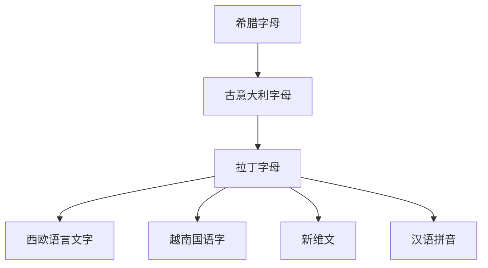

# 拉丁字母

## 概括

拉丁字母由古意大利字母传统发展而来，最初用于拉丁语，后随罗马帝国、基督教、欧洲殖民、印刷和现代国家教育体系扩散，成为当代使用范围最广的文字之一。

## 演变关系

## 说明

- 拉丁字母是字母文字，基本单位表示音素，但不同语言的拼写规则差异很大。
- 现代拉丁字母常通过附加符号、二合字母或扩展字母适配不同语言。
- 新维文是现代维吾尔语拉丁化方案之一，与传统维文的阿拉伯字母谱系不同。

