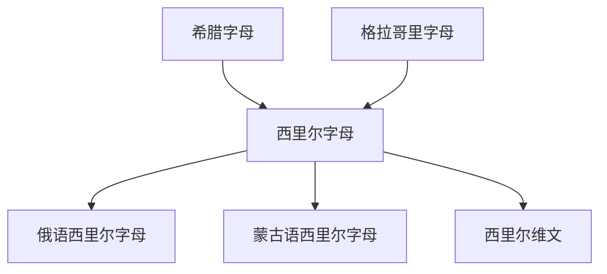

# 西里尔字母

## 概括

西里尔字母是在希腊字母和斯拉夫基督教书写传统基础上形成的文字体系，用于俄语、乌克兰语、保加利亚语、塞尔维亚语、蒙古语等多种语言的不同版本。

## 演变关系

```mermaid
graph TD
  Greek["希腊字母"] --> Cyrillic["西里尔字母"]
  Glagolitic["格拉哥里字母"] --> Cyrillic
  Cyrillic --> Russian["俄语西里尔字母"]
  Cyrillic --> MongolianCyrillic["蒙古语西里尔字母"]
  Cyrillic --> UyghurCyrillic["西里尔维文"]
```

## 说明

- 西里尔字母不是传统蒙古文的来源；蒙古语西里尔字母是近现代另行采用的书写体系。
- 西里尔维文是维吾尔语在特定历史时期使用的西里尔字母方案，与传统维文、新维文属于不同书写方案。

