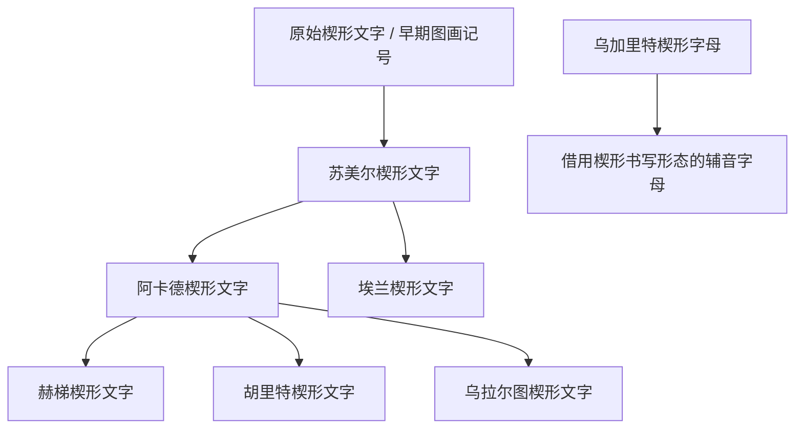

# 楔形文字

## 时间

约前3400-前3000年在两河流域形成，前1千纪后期逐渐被阿拉米文字等拼音文字取代，最后的楔形文字材料延续到公元1世纪前后。

## 概括

楔形文字是两河流域最早的成熟书写传统。早期符号多与会计、货物、土地、人员和神庙经济有关，后来用削成三角尖的芦苇笔在湿泥板上压印，形成“楔形”笔画。

它不是某一种语言专属的字母，而是一套可被多种语言借用的书写技术：苏美尔语、阿卡德语、埃兰语、赫梯语、胡里特语、乌拉尔图语等都曾使用楔形文字或其改造形式。

## 演变关系

## 主要分支

| 名称 | 关系 | 简要说明 |
|---|---|---|
| 原始楔形文字 | 早期阶段 | 从图像、数字和会计记号走向可记录语言的系统。 |
| 苏美尔楔形文字 | 成熟主干 | 记录苏美尔语，奠定楔形文字的语标和音节符号传统。 |
| 阿卡德楔形文字 | 重要借用分支 | 闪米特语阿卡德语借用并改造苏美尔书写体系。 |
| 赫梯楔形文字 | 安纳托利亚分支 | 印欧语赫梯语采用阿卡德楔形传统。 |
| 乌加里特楔形字母 | 形态借用 | 外形为楔形，但结构是辅音字母，不能简单等同于苏美尔-阿卡德楔形传统。 |

## 说明

- 楔形文字的关键特征是书写媒介和笔画形态；它可以同时含有语标、音节符号和限定符。
- 早期用途偏行政和经济，后来扩展到王室铭文、法律、文学、数学、天文和宗教文本。
- 《吉尔伽美什史诗》、汉谟拉比法典、亚述和巴比伦王室档案都依赖楔形文字传统保存。

