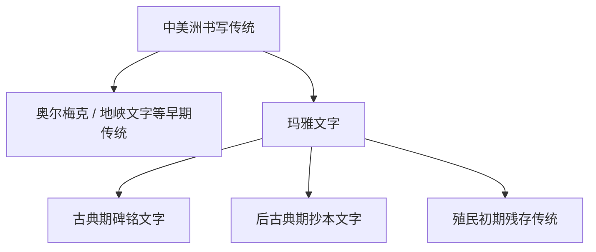

# 玛雅文字

## 时间

至少可追溯到前3世纪至前2世纪；古典期玛雅城邦大量使用，西班牙征服后仍在部分地区延续到17世纪前后，但传统写本大多被毁。

## 概括

玛雅文字是中美洲玛雅文明使用的语标-音节文字。它由表示词或词素的语标、表示音节的音节符号，以及日期、称号、地名和仪式表达构成，能够记录复杂的玛雅语言文本。

玛雅文字是前哥伦布时代美洲释读程度最高的文字体系，材料见于石碑、建筑、陶器、贝壳、骨器和少数幸存抄本。

## 演变关系

## 说明

- 玛雅文字不是字母。一个符号可能作为语标使用，也可能具有一个或多个音节读法。
- 古典期碑铭常记录王朝继承、战争、仪式、献祭、天文历法和纪年。
- 玛雅文字不是中美洲最早文字；但它是现存材料最丰富、释读最充分的中美洲文字体系之一。
- 西班牙殖民时期大量玛雅抄本被毁，现存抄本数量很少，这造成材料断裂。

## 参考资料

- [Britannica: Maya hieroglyphic writing](https://www.britannica.com/topic/Maya-hieroglyphic-writing)
- [Britannica: Mesoamerican writing systems](https://www.britannica.com/topic/Mesoamerican-Indian-languages/Mesoamerican-writing-systems)
- [World History Encyclopedia: Maya Writing](https://www.worldhistory.org/article/655/maya-writing/)
