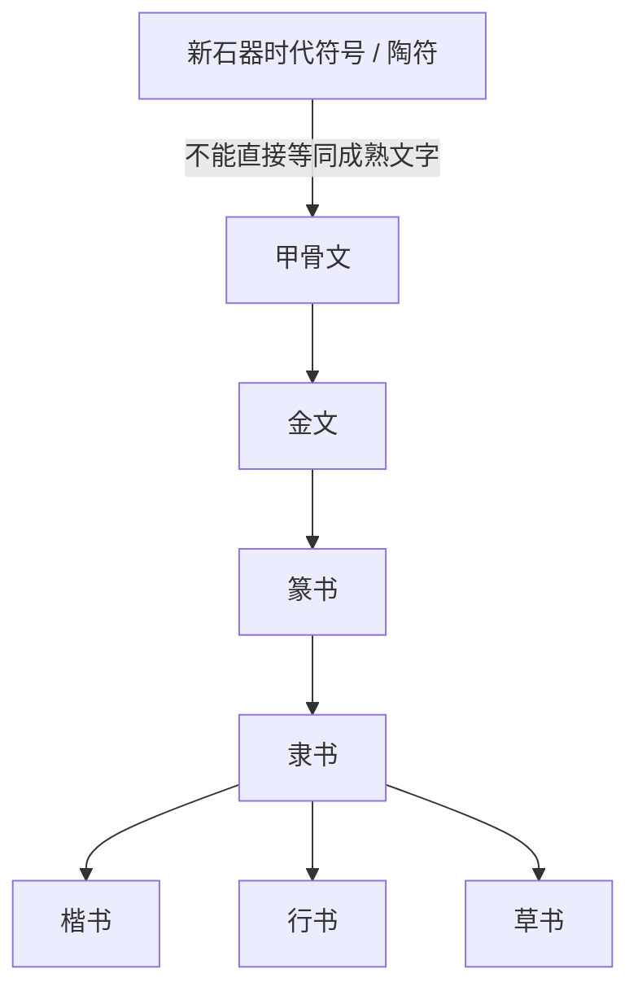

# 甲骨文

## 时间

主要见于商代晚期，约前13世纪至前11世纪；材料集中于殷墟及相关遗址。

## 概括

甲骨文是刻写或少量书写在龟甲、兽骨上的早期汉字形态，内容多为商王室占卜记录。它是目前可确认的最早成体系汉字材料，也是研究商代政治、祭祀、战争、农业、天象、疾病和王室谱系的重要资料。

甲骨文不是孤立文字系统，而是汉字发展史的早期可见阶段。它之后与青铜器铭文等传统共同进入金文、小篆、隶书、楷书等书体演变线索。

## 演变关系

## 说明

- 甲骨文记录的是商王室占卜活动，常见内容包括问事、验辞、祭祀对象、战争、田猎、风雨、疾病、生育等。
- 甲骨文字形仍有较强图像性，但已经具备成熟书写系统所需的构形、语法记录和重复使用能力。
- “甲骨文是中国最早文字”应谨慎表述：更准确说法是“目前已知成体系的最早汉字材料”。更早符号存在，但是否已经完整记录语言仍需分别判断。
- 甲骨文与金文并不是简单前后替代关系，晚商和西周早期有并行与互相影响。

## 相关笔记

- [商](/%E4%BA%BA%E6%96%87%E7%A7%91%E5%AD%A6/%E5%8E%86%E5%8F%B2-%E4%B8%AD%E5%9B%BD/%E6%9C%9D%E4%BB%A3/%E5%95%86/README.md)

