# 语言

语言体系整理时，优先区分“语言谱系”和“文字系统”：语系、语族、语支讨论的是语言亲缘；汉字、拉丁字母、阿拉伯字母、谚文等是书写系统，不能拿来替代语言分类。

## 总览

```mermaid
graph TD
  Language["语言"] --> IE["印欧语系"]
  Language --> ST["汉藏语系"]
  Language --> AA["亚非语系"]
  Language --> Uralic["乌拉尔语系"]
  Language --> Austroasiatic["南亚语系"]
  Language --> Austronesian["南岛语系"]
  Language --> KraDai["壮侗语系"]
  Language --> NigerCongo["尼日尔-刚果语系"]
  Language --> Dravidian["达罗毗荼语系"]
  Language --> Kartvelian["南高加索语系"]
  Language --> Altaic["阿尔泰假说与相关语族"]
  Language --> Isolates["孤立语言与未定分类"]
  Language --> Contact["接触语言 / 克里奥尔语"]

  IE --> Germanic["日耳曼语族"]
  Germanic --> WestGermanic["西日耳曼语支"]
  WestGermanic --> English["01 英语"]
  WestGermanic --> German["12 德语"]

  IE --> IndoIranian["印度-伊朗语族"]
  IndoIranian --> IndoAryan["印度-雅利安语支"]
  IndoAryan --> Hindi["03 印地语"]
  IndoAryan --> Bengali["07 孟加拉语"]
  IndoAryan --> Urdu["11 乌尔都语"]
  IndoAryan --> Marathi["16 马拉地语"]
  IndoAryan --> WesternPunjabi["21 西旁遮普语"]
  IndoAryan --> Sanskrit["梵语（印度古典 / 印度宗教）"]
  IndoAryan --> Pali["巴利语（南传佛教）"]
  IndoIranian --> Iranian["伊朗语支"]
  Iranian --> Persian["26 波斯语 / 法尔西语"]
  Iranian --> Avestan["阿维斯陀语（祆教经典）"]

  IE --> Italic["意大利语族"]
  Italic --> Latin["拉丁语（古典 / 教会 / 学术）"]
  Latin --> Romance["罗曼语族"]
  Latin --> Italian["30 意大利语"]
  Romance --> Spanish["04 西班牙语"]
  Romance --> French["06 法语"]
  Romance --> Portuguese["08 葡萄牙语"]

  IE --> Hellenic["希腊语族"]
  Hellenic --> AncientGreek["古希腊语（古典 / 哲学 / 科学术语）"]

  IE --> BaltoSlavic["波罗的-斯拉夫语族"]
  BaltoSlavic --> Slavic["斯拉夫语族"]
  Slavic --> EastSlavic["东斯拉夫语支"]
  EastSlavic --> Russian["09 俄语"]

  ST --> Sinitic["汉语族"]
  Sinitic --> Mandarin["02 官话 / 普通话"]
  Sinitic --> Cantonese["25 粤语 / 广府话"]
  Sinitic --> ClassicalChinese["文言文 / 古典汉语（东亚书面传统）"]
  ST --> TibetoBurman["藏缅语族"]
  TibetoBurman --> Tibetan["藏语（藏传佛教）"]

  AA --> Semitic["闪米特语族"]
  Semitic --> CentralSemitic["中闪米特语支"]
  CentralSemitic --> ArabicBranch["阿拉伯语支"]
  ArabicBranch --> StandardArabic["05 现代标准阿拉伯语"]
  ArabicBranch --> EgyptianArabic["15 埃及阿拉伯语"]
  ArabicBranch --> ClassicalArabic["古典阿拉伯语（伊斯兰经典）"]
  Semitic --> NorthwestSemitic["西北闪米特分支"]
  NorthwestSemitic --> Hebrew["希伯来语（犹太经典 / 现代复兴）"]
  AA --> Chadic["乍得语族"]
  Chadic --> Hausa["19 豪萨语"]

  NigerCongo --> AtlanticCongo["大西洋-刚果语族"]
  AtlanticCongo --> Bantu["班图语支"]
  Bantu --> Swahili["22 斯瓦希里语"]

  Austronesian --> MP["马来-波利尼西亚语族"]
  MP --> Malayic["马来语群"]
  Malayic --> Indonesian["10 印尼语"]
  MP --> CentralPhilippine["中菲律宾语支"]
  CentralPhilippine --> Tagalog["23 他加禄语"]
  MP --> Javanese["29 爪哇语"]

  Isolates --> Japonic["日本语系"]
  Japonic --> Japanese["13 日语"]
  Isolates --> Koreanic["朝鲜语族 / 朝鲜语"]
  Koreanic --> Korean["28 韩语 / 朝鲜语"]

  Contact --> EnglishCreole["英语克里奥尔语"]
  EnglishCreole --> NigerianPidgin["14 尼日利亚皮钦语"]

  Austroasiatic --> Vietic["越-芒语支"]
  Vietic --> Vietnamese["17 越南语"]

  Dravidian --> SouthCentralDravidian["中南达罗毗荼语支"]
  SouthCentralDravidian --> Telugu["18 泰卢固语"]
  Dravidian --> SouthDravidian["南达罗毗荼语支"]
  SouthDravidian --> Tamil["24 泰米尔语"]

  KraDai --> Tai["台语支"]
  Tai --> Thai["27 泰语"]

  Altaic --> Turkic["突厥语族"]
  Turkic --> Oghuz["乌古斯语支"]
  Oghuz --> Turkish["20 土耳其语"]
```

上图中的编号语言按 2025 年总使用者规模口径选取，用来展示现代主流广泛语言的谱系位置；已扩展到前 30。未编号节点表示使用者规模未必进入前列、但在古典教育、宗教经典、学术术语或区域文明史中地位很高的语言。不同统计会因“阿拉伯语 / 汉语 / 马来语等是否按宏语言合并”而改变边界和排序。

| 类别 | 地区 | 代表语言 | 说明 |
|---|---|---|---|
| [印欧语系](/%E4%BA%BA%E6%96%87%E7%A7%91%E5%AD%A6/%E8%AF%AD%E8%A8%80/%E5%8D%B0%E6%AC%A7%E8%AF%AD%E7%B3%BB/README.md) | 欧洲、西亚、南亚及全球扩散区 | 英语、俄语、印地语、西班牙语、波斯语 | 当前分布最广的语系之一。 |
| [汉藏语系](/%E4%BA%BA%E6%96%87%E7%A7%91%E5%AD%A6/%E8%AF%AD%E8%A8%80/%E6%B1%89%E8%97%8F%E8%AF%AD%E7%B3%BB/README.md) | 东亚、东南亚、喜马拉雅地区 | 汉语、藏语、缅甸语 | 汉语族和藏缅语族是最常见的总览层级。 |
| [亚非语系](/%E4%BA%BA%E6%96%87%E7%A7%91%E5%AD%A6/%E8%AF%AD%E8%A8%80/%E4%BA%9A%E9%9D%9E%E8%AF%AD%E7%B3%BB/README.md) | 北非、西亚、非洲之角、撒哈拉周边 | 阿拉伯语、希伯来语、阿姆哈拉语、索马里语 | 包含闪米特、库希特等分支。 |
| [乌拉尔语系](/%E4%BA%BA%E6%96%87%E7%A7%91%E5%AD%A6/%E8%AF%AD%E8%A8%80/%E4%B9%8C%E6%8B%89%E5%B0%94%E8%AF%AD%E7%B3%BB/README.md) | 北欧、东欧、西西伯利亚 | 匈牙利语、芬兰语、爱沙尼亚语 | 与印欧语系不同源，常见于欧洲北部和东部。 |
| [南亚语系](/%E4%BA%BA%E6%96%87%E7%A7%91%E5%AD%A6/%E8%AF%AD%E8%A8%80/%E5%8D%97%E4%BA%9A%E8%AF%AD%E7%B3%BB/README.md) | 东南亚、南亚局部 | 越南语、高棉语 | 又称 Austroasiatic，不等于“南亚地区所有语言”。 |
| [南岛语系](/%E4%BA%BA%E6%96%87%E7%A7%91%E5%AD%A6/%E8%AF%AD%E8%A8%80/%E5%8D%97%E5%B2%9B%E8%AF%AD%E7%B3%BB/README.md) | 台湾、东南亚岛屿、大洋洲、马达加斯加 | 马来语、印尼语、菲律宾语 | 海洋扩散范围极广。 |
| [壮侗语系](/%E4%BA%BA%E6%96%87%E7%A7%91%E5%AD%A6/%E8%AF%AD%E8%A8%80/%E5%A3%AE%E4%BE%97%E8%AF%AD%E7%B3%BB/README.md) | 华南、中南半岛 | 泰语、老挝语、壮语 | 又称 Kra-Dai / Tai-Kadai。 |
| [尼日尔-刚果语系](/%E4%BA%BA%E6%96%87%E7%A7%91%E5%AD%A6/%E8%AF%AD%E8%A8%80/%E5%B0%BC%E6%97%A5%E5%B0%94-%E5%88%9A%E6%9E%9C%E8%AF%AD%E7%B3%BB/README.md) | 撒哈拉以南非洲 | 约鲁巴语、斯瓦希里语等 | 按语言数量计为世界大语系之一。 |
| [达罗毗荼语系](/%E4%BA%BA%E6%96%87%E7%A7%91%E5%AD%A6/%E8%AF%AD%E8%A8%80/%E8%BE%BE%E7%BD%97%E6%AF%97%E8%8D%BC%E8%AF%AD%E7%B3%BB/README.md) | 南印度、斯里兰卡及周边 | 泰米尔语、泰卢固语、卡纳达语 | 与印欧语系的印度-雅利安语言不同源。 |
| [南高加索语系](/%E4%BA%BA%E6%96%87%E7%A7%91%E5%AD%A6/%E8%AF%AD%E8%A8%80/%E5%8D%97%E9%AB%98%E5%8A%A0%E7%B4%A2%E8%AF%AD%E7%B3%BB/README.md) | 高加索南部 | 格鲁吉亚语 | 又称 Kartvelian。 |
| [阿尔泰假说与相关语族](/%E4%BA%BA%E6%96%87%E7%A7%91%E5%AD%A6/%E8%AF%AD%E8%A8%80/%E9%98%BF%E5%B0%94%E6%B3%B0%E5%81%87%E8%AF%B4%E4%B8%8E%E7%9B%B8%E5%85%B3%E8%AF%AD%E6%97%8F/README.md) | 欧亚草原和北亚 | 突厥语族、蒙古语族 | “阿尔泰语系”不是普遍接受的确定语系，应作为假说和区域相似性处理。 |
| [孤立语言与未定分类](/%E4%BA%BA%E6%96%87%E7%A7%91%E5%AD%A6/%E8%AF%AD%E8%A8%80/%E5%AD%A4%E7%AB%8B%E8%AF%AD%E8%A8%80%E4%B8%8E%E6%9C%AA%E5%AE%9A%E5%88%86%E7%B1%BB/README.md) | 多地区 | 日语、朝鲜语/韩语 | 日语属于日本语系；朝鲜语/韩语常作为小语系或孤立语处理。 |

## 易混点

- “语系”是亲缘分类，不等于国家、民族、宗教或文字系统。
- 一个语言可以使用多种文字，例如蒙古语可用传统蒙古文和西里尔字母；一个文字也可服务多种语言，例如拉丁字母、阿拉伯字母。
- “阿尔泰语系”在现代比较语言学中争议很大；整理时把突厥语族、蒙古语族作为已确认语族，把“阿尔泰”作为假说或语区相似性说明。
- 汉语内部的官话、吴语、粤语、闽语等可按“汉语族 → 汉语方言群 / 汉语分支”整理，不把“汉字”写成语族名的一部分。

