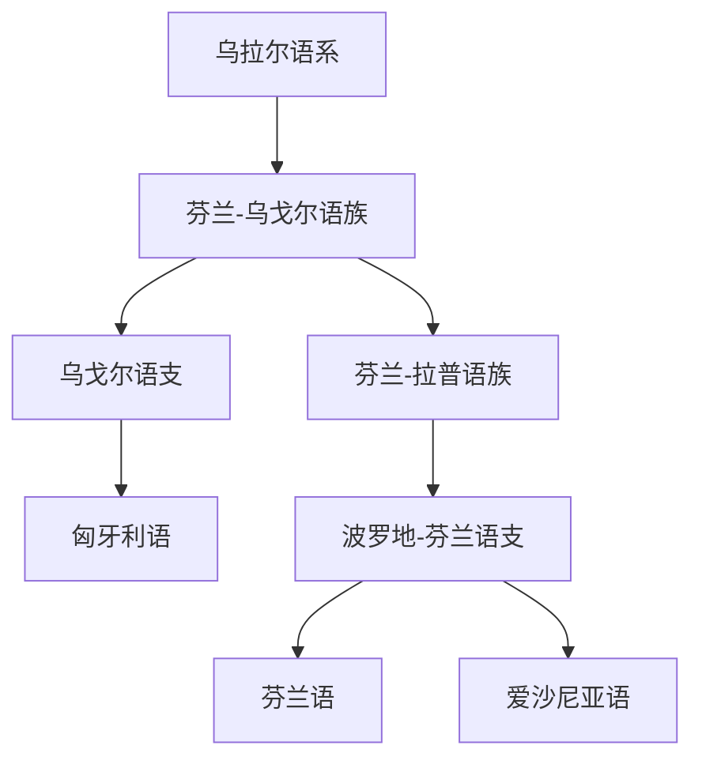

# 乌拉尔语系

## 概括

乌拉尔语系主要分布在北欧、东欧和西西伯利亚，代表语言包括匈牙利语、芬兰语、爱沙尼亚语等。

## 分类关系

## 子系统

| 分支 / 语言 | 代表内容 | 说明 |
|---|---|---|
| [芬兰-乌戈尔语族](/%E4%BA%BA%E6%96%87%E7%A7%91%E5%AD%A6/%E8%AF%AD%E8%A8%80/%E4%B9%8C%E6%8B%89%E5%B0%94%E8%AF%AD%E7%B3%BB/%E8%8A%AC%E5%85%B0-%E4%B9%8C%E6%88%88%E5%B0%94%E8%AF%AD%E6%97%8F/README.md) | 匈牙利语、芬兰语、爱沙尼亚语 | 本目录采用的主要下层。 |

## 说明

芬兰-乌戈尔是常见传统层级；现代乌拉尔语系内部分类仍有不同方案。

## 上级

- [语言](/%E4%BA%BA%E6%96%87%E7%A7%91%E5%AD%A6/%E8%AF%AD%E8%A8%80/README.md)

