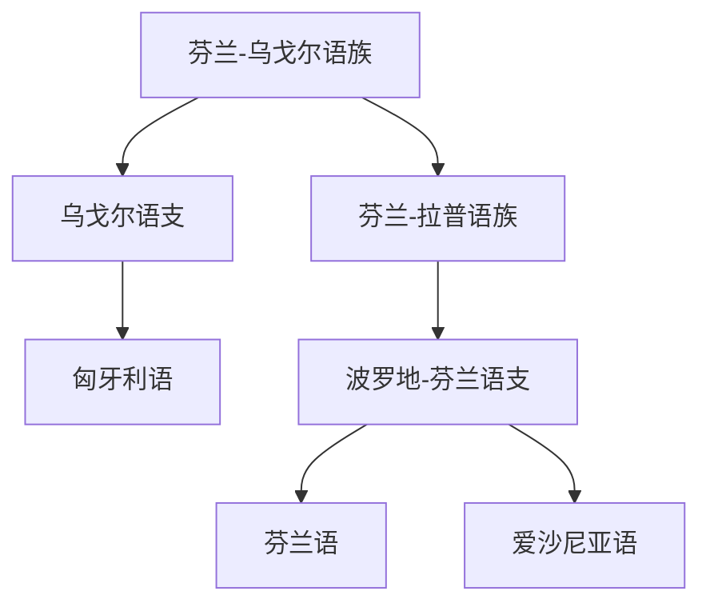

# 芬兰-乌戈尔语族

## 概括

芬兰-乌戈尔语族是乌拉尔语系的传统大分支，用于整理 乌戈尔语支与芬兰-拉普语族。

## 分类关系

## 子系统

| 分支 / 语言 | 代表内容 | 说明 |
|---|---|---|
| [乌戈尔语支](/%E4%BA%BA%E6%96%87%E7%A7%91%E5%AD%A6/%E8%AF%AD%E8%A8%80/%E4%B9%8C%E6%8B%89%E5%B0%94%E8%AF%AD%E7%B3%BB/%E8%8A%AC%E5%85%B0-%E4%B9%8C%E6%88%88%E5%B0%94%E8%AF%AD%E6%97%8F/%E4%B9%8C%E6%88%88%E5%B0%94%E8%AF%AD%E6%94%AF/README.md) | 匈牙利语 | 匈牙利语主要使用拉丁字母，另有古匈牙利字母传统。 |
| [芬兰-拉普语族](/%E4%BA%BA%E6%96%87%E7%A7%91%E5%AD%A6/%E8%AF%AD%E8%A8%80/%E4%B9%8C%E6%8B%89%E5%B0%94%E8%AF%AD%E7%B3%BB/%E8%8A%AC%E5%85%B0-%E4%B9%8C%E6%88%88%E5%B0%94%E8%AF%AD%E6%97%8F/%E8%8A%AC%E5%85%B0-%E6%8B%89%E6%99%AE%E8%AF%AD%E6%97%8F/README.md) | 芬兰语、爱沙尼亚语 | 本目录展开波罗地-芬兰语支。 |

## 说明

该层级用于保留主要分支、代表语言、书写系统和分类争议。

## 上级

- [乌拉尔语系](/%E4%BA%BA%E6%96%87%E7%A7%91%E5%AD%A6/%E8%AF%AD%E8%A8%80/%E4%B9%8C%E6%8B%89%E5%B0%94%E8%AF%AD%E7%B3%BB/README.md)

