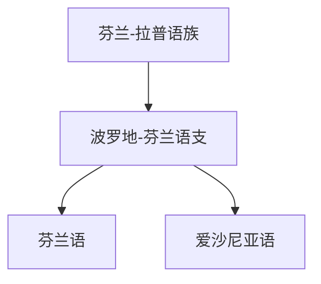

# 芬兰-拉普语族

## 概括

芬兰-拉普语族是 用于整理波罗地-芬兰语支的层级。

## 分类关系

## 子系统

| 分支 / 语言 | 代表内容 | 说明 |
|---|---|---|
| 波罗地-芬兰语支 | 芬兰语、爱沙尼亚语 | 主要分布于芬兰、爱沙尼亚及周边。 |

## 说明

该层级用于保留主要分支、代表语言、书写系统和分类争议。

## 上级

- [芬兰-乌戈尔语族](/%E4%BA%BA%E6%96%87%E7%A7%91%E5%AD%A6/%E8%AF%AD%E8%A8%80/%E4%B9%8C%E6%8B%89%E5%B0%94%E8%AF%AD%E7%B3%BB/%E8%8A%AC%E5%85%B0-%E4%B9%8C%E6%88%88%E5%B0%94%E8%AF%AD%E6%97%8F/README.md)

