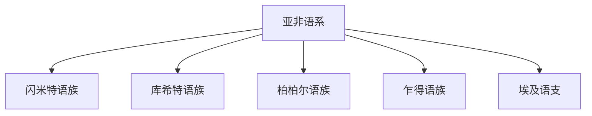

# 亚非语系

## 范围

亚非语系主要分布在北非、西亚、非洲之角和撒哈拉周边地区。

## 概括

亚非语系包括闪米特、库希特、柏柏尔、乍得、埃及等分支。本目录先展开闪米特语族和库希特语族，其他分支保留在总览中。

## 分类关系

## 子系统

| 分支 | 代表语言 | 说明 |
|---|---|---|
| [闪米特语族](/%E4%BA%BA%E6%96%87%E7%A7%91%E5%AD%A6/%E8%AF%AD%E8%A8%80/%E4%BA%9A%E9%9D%9E%E8%AF%AD%E7%B3%BB/%E9%97%AA%E7%B1%B3%E7%89%B9%E8%AF%AD%E6%97%8F/README.md) | 阿拉伯语、希伯来语、阿姆哈拉语 | 与西亚、北非和埃塞俄比亚高原关系密切。 |
| [库希特语族](/%E4%BA%BA%E6%96%87%E7%A7%91%E5%AD%A6/%E8%AF%AD%E8%A8%80/%E4%BA%9A%E9%9D%9E%E8%AF%AD%E7%B3%BB/%E5%BA%93%E5%B8%8C%E7%89%B9%E8%AF%AD%E6%97%8F/README.md) | 索马里语 | 主要分布于非洲之角。 |

