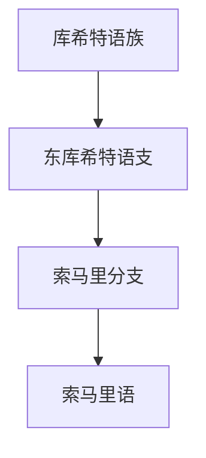

# 库希特语族

## 概括

库希特语族属于亚非语系，主要分布于非洲之角及周边地区。

## 分类关系

## 子系统

| 分支 / 语言 | 代表内容 | 说明 |
|---|---|---|
| 东库希特语支 | 索马里语 | 索马里语现代标准书写主要使用拉丁字母。 |

## 说明

库希特语族内部分类较复杂，本目录只展开索马里语相关分支。

## 上级

- [亚非语系](/%E4%BA%BA%E6%96%87%E7%A7%91%E5%AD%A6/%E8%AF%AD%E8%A8%80/%E4%BA%9A%E9%9D%9E%E8%AF%AD%E7%B3%BB/README.md)

