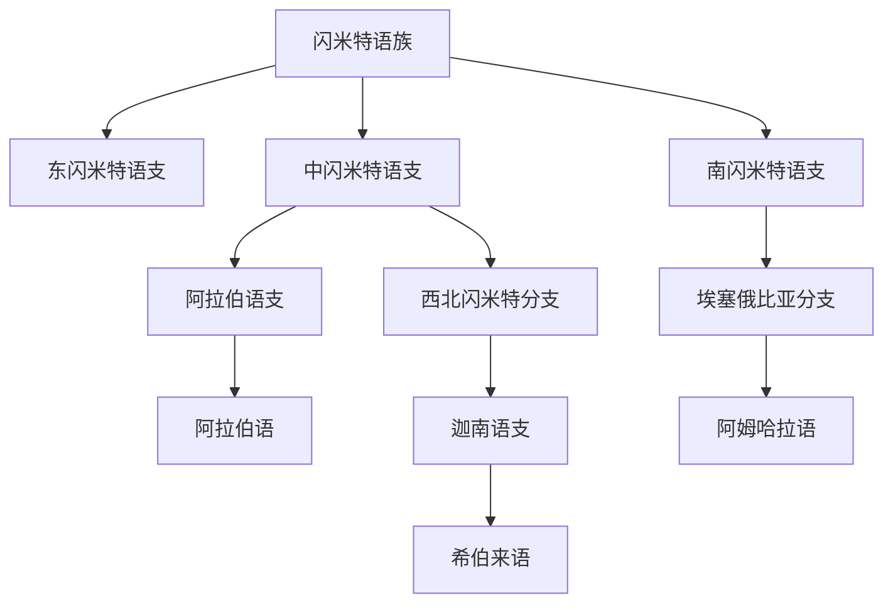

# 闪米特语族

## 概括

闪米特语族是亚非语系的重要分支，历史上包括阿卡德语、希伯来语、阿拉伯语、阿拉姆语等，现代包括阿拉伯语、希伯来语、阿姆哈拉语等。

## 分类关系

## 子系统

| 分支 / 语言 | 代表内容 | 说明 |
|---|---|---|
| 东闪米特语支 | 阿卡德语等 | 多为古代已灭绝语言。 |
| 中闪米特语支 | 阿拉伯语、希伯来语 | 阿拉伯语多用阿拉伯字母；希伯来语多用希伯来字母。 |
| 南闪米特语支 | 阿姆哈拉语等 | 阿姆哈拉语多用吉兹字母传统。 |

## 说明

“闪米特”是语言分类名称，不应直接等同民族或宗教分类。

## 上级

- [亚非语系](/%E4%BA%BA%E6%96%87%E7%A7%91%E5%AD%A6/%E8%AF%AD%E8%A8%80/%E4%BA%9A%E9%9D%9E%E8%AF%AD%E7%B3%BB/README.md)

