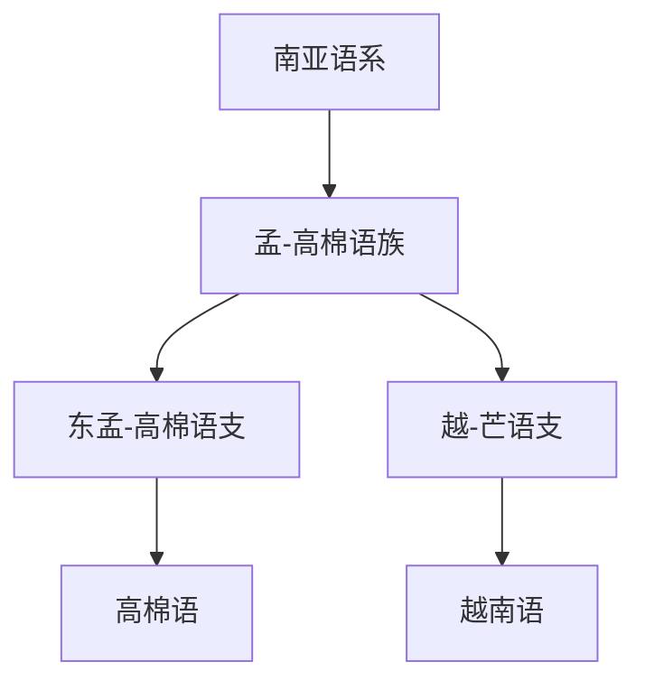

# 南亚语系

## 概括

南亚语系又称 Austroasiatic，主要分布于东南亚大陆和南亚局部，代表语言包括越南语和高棉语。

## 分类关系

## 子系统

| 分支 / 语言 | 代表内容 | 说明 |
|---|---|---|
| [孟-高棉语族](/%E4%BA%BA%E6%96%87%E7%A7%91%E5%AD%A6/%E8%AF%AD%E8%A8%80/%E5%8D%97%E4%BA%9A%E8%AF%AD%E7%B3%BB/%E5%AD%9F-%E9%AB%98%E6%A3%89%E8%AF%AD%E6%97%8F/README.md) | 高棉语、越南语 | 本目录的主要分支。 |

## 说明

南亚语系不要与“南亚地区所有语言”混淆；印度北部大量语言属于印欧语系，南印度大量语言属于达罗毗荼语系。

## 上级

- [语言](/%E4%BA%BA%E6%96%87%E7%A7%91%E5%AD%A6/%E8%AF%AD%E8%A8%80/README.md)

