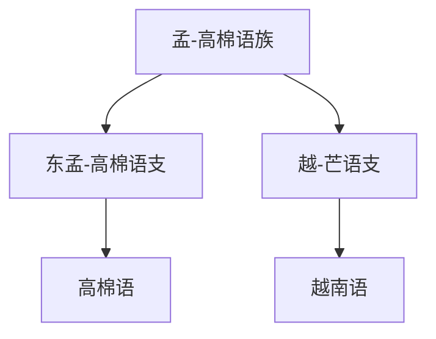

# 孟-高棉语族

## 概括

孟-高棉语族是南亚语系中的传统大分支，本目录展开高棉语和越南语相关支系。

## 分类关系

## 子系统

| 分支 / 语言 | 代表内容 | 说明 |
|---|---|---|
| [东孟-高棉语支](/%E4%BA%BA%E6%96%87%E7%A7%91%E5%AD%A6/%E8%AF%AD%E8%A8%80/%E5%8D%97%E4%BA%9A%E8%AF%AD%E7%B3%BB/%E5%AD%9F-%E9%AB%98%E6%A3%89%E8%AF%AD%E6%97%8F/%E4%B8%9C%E5%AD%9F-%E9%AB%98%E6%A3%89%E8%AF%AD%E6%94%AF/README.md) | 高棉语 | 柬埔寨主体语言。 |
| [越-芒语支](/%E4%BA%BA%E6%96%87%E7%A7%91%E5%AD%A6/%E8%AF%AD%E8%A8%80/%E5%8D%97%E4%BA%9A%E8%AF%AD%E7%B3%BB/%E5%AD%9F-%E9%AB%98%E6%A3%89%E8%AF%AD%E6%97%8F/%E8%B6%8A-%E8%8A%92%E8%AF%AD%E6%94%AF/README.md) | 越南语 | 越南语现代标准书写使用国语字。 |

## 说明

该层级用于保留主要分支、代表语言、书写系统和分类争议。

## 上级

- [南亚语系](/%E4%BA%BA%E6%96%87%E7%A7%91%E5%AD%A6/%E8%AF%AD%E8%A8%80/%E5%8D%97%E4%BA%9A%E8%AF%AD%E7%B3%BB/README.md)

