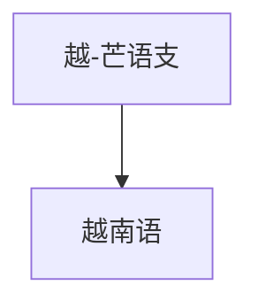

# 越-芒语支

## 概括

越-芒语支属于南亚语系，代表语言包括越南语。

## 分类关系

## 子系统

| 分支 / 语言 | 代表内容 | 说明 |
|---|---|---|
| 越南语 | 国语字 | 现代标准越南语主要使用拉丁字母基础的国语字。 |

## 说明

该层级用于保留主要分支、代表语言、书写系统和分类争议。

## 上级

- [孟-高棉语族](/%E4%BA%BA%E6%96%87%E7%A7%91%E5%AD%A6/%E8%AF%AD%E8%A8%80/%E5%8D%97%E4%BA%9A%E8%AF%AD%E7%B3%BB/%E5%AD%9F-%E9%AB%98%E6%A3%89%E8%AF%AD%E6%97%8F/README.md)

