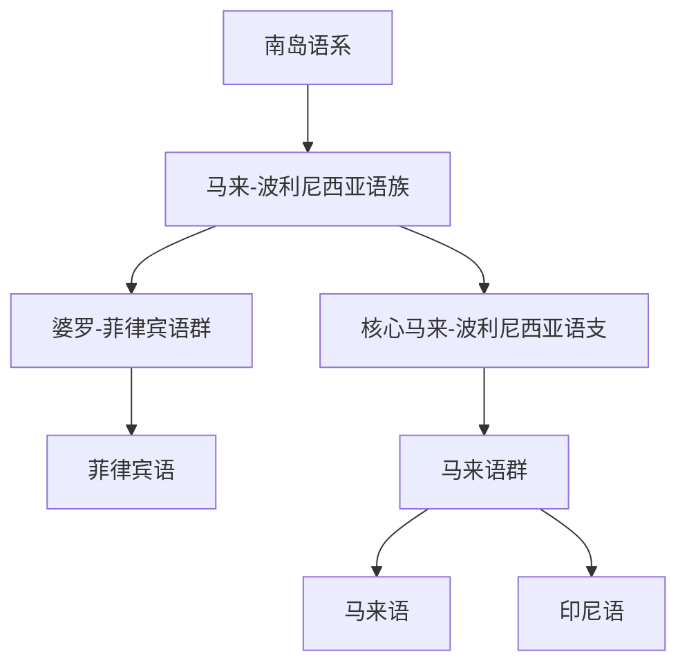

# 南岛语系

## 概括

南岛语系分布从台湾、东南亚岛屿到太平洋群岛和马达加斯加，代表语言包括马来语、印尼语、菲律宾语等。

## 分类关系

## 子系统

| 分支 / 语言 | 代表内容 | 说明 |
|---|---|---|
| [马来-波利尼西亚语族](/%E4%BA%BA%E6%96%87%E7%A7%91%E5%AD%A6/%E8%AF%AD%E8%A8%80/%E5%8D%97%E5%B2%9B%E8%AF%AD%E7%B3%BB/%E9%A9%AC%E6%9D%A5-%E6%B3%A2%E5%88%A9%E5%B0%BC%E8%A5%BF%E4%BA%9A%E8%AF%AD%E6%97%8F/README.md) | 马来语、印尼语、菲律宾语 | 本目录的主要分支。 |

## 说明

南岛语系的原乡和早期扩散通常与台湾及海洋迁徙相关。

## 上级

- [语言](/%E4%BA%BA%E6%96%87%E7%A7%91%E5%AD%A6/%E8%AF%AD%E8%A8%80/README.md)

