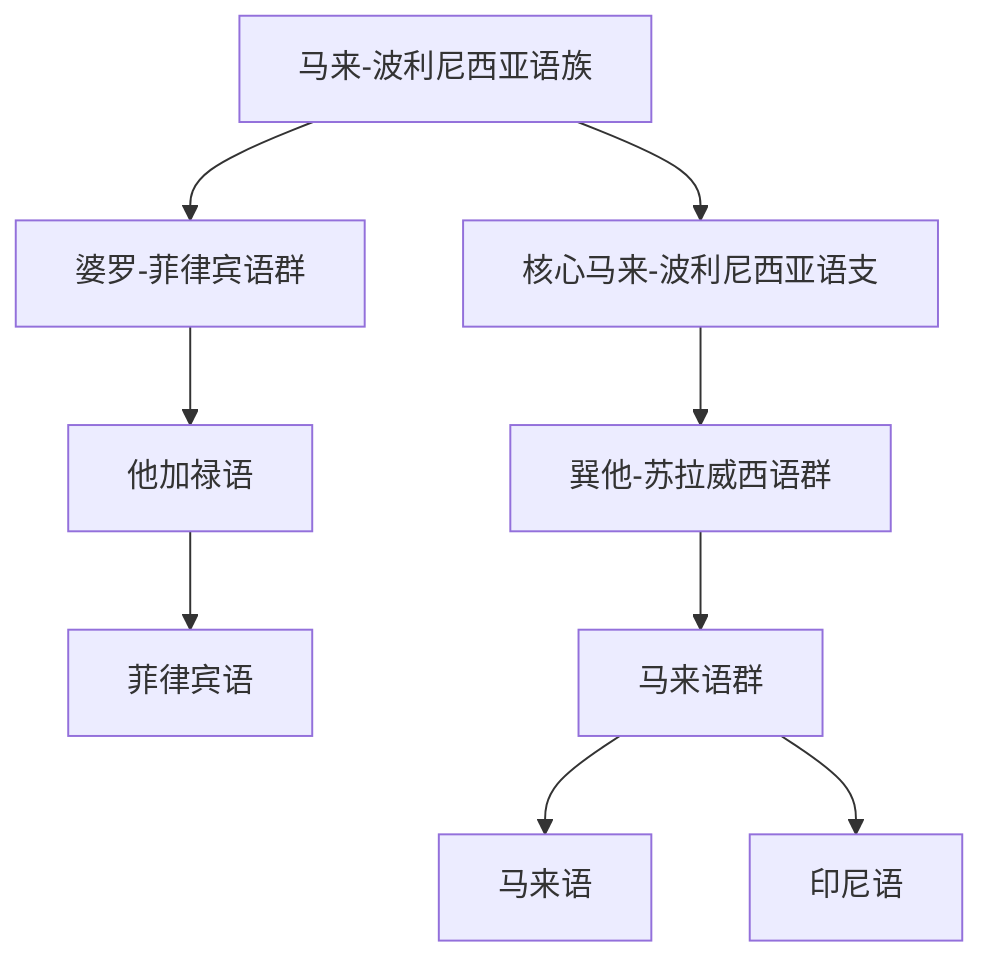

# 马来-波利尼西亚语族

## 概括

马来-波利尼西亚语族是南岛语系中覆盖范围极广的分支，本目录保留婆罗-菲律宾语群和核心马来-波利尼西亚语支。

## 分类关系

## 子系统

| 分支 / 语言 | 代表内容 | 说明 |
|---|---|---|
| [婆罗-菲律宾语群](/%E4%BA%BA%E6%96%87%E7%A7%91%E5%AD%A6/%E8%AF%AD%E8%A8%80/%E5%8D%97%E5%B2%9B%E8%AF%AD%E7%B3%BB/%E9%A9%AC%E6%9D%A5-%E6%B3%A2%E5%88%A9%E5%B0%BC%E8%A5%BF%E4%BA%9A%E8%AF%AD%E6%97%8F/%E5%A9%86%E7%BD%97-%E8%8F%B2%E5%BE%8B%E5%AE%BE%E8%AF%AD%E7%BE%A4/README.md) | 菲律宾语 | 由中菲律宾语支、他加禄语进入菲律宾语。 |
| [核心马来-波利尼西亚语支](/%E4%BA%BA%E6%96%87%E7%A7%91%E5%AD%A6/%E8%AF%AD%E8%A8%80/%E5%8D%97%E5%B2%9B%E8%AF%AD%E7%B3%BB/%E9%A9%AC%E6%9D%A5-%E6%B3%A2%E5%88%A9%E5%B0%BC%E8%A5%BF%E4%BA%9A%E8%AF%AD%E6%97%8F/%E6%A0%B8%E5%BF%83%E9%A9%AC%E6%9D%A5-%E6%B3%A2%E5%88%A9%E5%B0%BC%E8%A5%BF%E4%BA%9A%E8%AF%AD%E6%94%AF/README.md) | 马来语、印尼语 | 由巽他-苏拉威西语群、马来语群进入马来语和印尼语。 |

## 说明

该层级用于保留主要分支、代表语言、书写系统和分类争议。

## 上级

- [南岛语系](/%E4%BA%BA%E6%96%87%E7%A7%91%E5%AD%A6/%E8%AF%AD%E8%A8%80/%E5%8D%97%E5%B2%9B%E8%AF%AD%E7%B3%BB/README.md)

