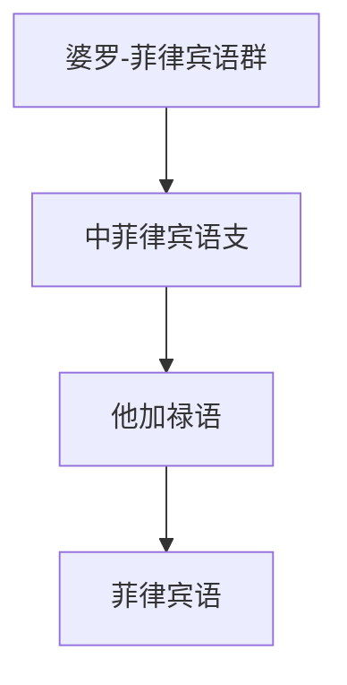

# 婆罗-菲律宾语群

## 概括

婆罗-菲律宾语群在 本目录主要展开中菲律宾语支、他加禄语和菲律宾语。

## 分类关系

## 子系统

| 分支 / 语言 | 代表内容 | 说明 |
|---|---|---|
| 中菲律宾语支 | 他加禄语、菲律宾语 | 菲律宾语以他加禄语为基础。 |

## 说明

该层级用于保留主要分支、代表语言、书写系统和分类争议。

## 上级

- [马来-波利尼西亚语族](/%E4%BA%BA%E6%96%87%E7%A7%91%E5%AD%A6/%E8%AF%AD%E8%A8%80/%E5%8D%97%E5%B2%9B%E8%AF%AD%E7%B3%BB/%E9%A9%AC%E6%9D%A5-%E6%B3%A2%E5%88%A9%E5%B0%BC%E8%A5%BF%E4%BA%9A%E8%AF%AD%E6%97%8F/README.md)

