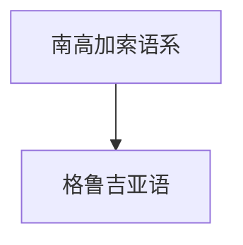

# 南高加索语系

## 概括

南高加索语系又称 Kartvelian，主要分布于高加索南部，代表语言是格鲁吉亚语。

## 分类关系

## 子系统

| 分支 / 语言 | 代表内容 | 说明 |
|---|---|---|
| [格鲁吉亚语](/%E4%BA%BA%E6%96%87%E7%A7%91%E5%AD%A6/%E8%AF%AD%E8%A8%80/%E5%8D%97%E9%AB%98%E5%8A%A0%E7%B4%A2%E8%AF%AD%E7%B3%BB/%E6%A0%BC%E9%B2%81%E5%90%89%E4%BA%9A%E8%AF%AD/README.md) | 格鲁吉亚字母 | 南高加索语系代表语言。 |

## 说明

南高加索语系不等同于地理上所有高加索语言；北高加索诸语另属不同分类。

## 上级

- [语言](/%E4%BA%BA%E6%96%87%E7%A7%91%E5%AD%A6/%E8%AF%AD%E8%A8%80/README.md)

