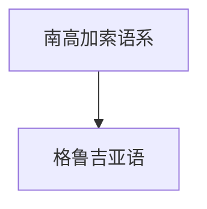

# 格鲁吉亚语

## 概括

格鲁吉亚语是南高加索语系代表语言，也是格鲁吉亚的主要官方语言。

## 分类关系

## 子系统

| 分支 / 语言 | 代表内容 | 说明 |
|---|---|---|
| 格鲁吉亚语 | 格鲁吉亚字母 | 具有独立书写传统。 |

## 说明

该层级用于保留主要分支、代表语言、书写系统和分类争议。

## 上级

- [南高加索语系](/%E4%BA%BA%E6%96%87%E7%A7%91%E5%AD%A6/%E8%AF%AD%E8%A8%80/%E5%8D%97%E9%AB%98%E5%8A%A0%E7%B4%A2%E8%AF%AD%E7%B3%BB/README.md)

