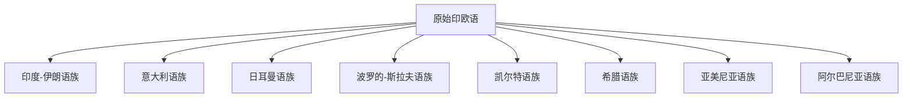

# 印欧语系

## 范围

印欧语系覆盖欧洲大部、伊朗高原、南亚北部和中部，并随近现代殖民、移民和国际交流扩散到全球。

## 概括

印欧语系是比较语言学研究最充分的语系之一，可重建共同祖语“原始印欧语”。本目录展开亚美尼亚、希腊、阿尔巴尼亚、印度-伊朗、意大利、日耳曼、波罗的-斯拉夫、凯尔特等主要分支。

## 分类关系

## 子系统

| 分支 | 代表语言 | 说明 |
|---|---|---|
| [印度-伊朗语族](/%E4%BA%BA%E6%96%87%E7%A7%91%E5%AD%A6/%E8%AF%AD%E8%A8%80/%E5%8D%B0%E6%AC%A7%E8%AF%AD%E7%B3%BB/%E5%8D%B0%E5%BA%A6-%E4%BC%8A%E6%9C%97%E8%AF%AD%E6%97%8F/README.md) | 印地语、乌尔都语、孟加拉语、波斯语、普什图语 | 南亚与伊朗高原的主要印欧分支。 |
| [意大利语族](/%E4%BA%BA%E6%96%87%E7%A7%91%E5%AD%A6/%E8%AF%AD%E8%A8%80/%E5%8D%B0%E6%AC%A7%E8%AF%AD%E7%B3%BB/%E6%84%8F%E5%A4%A7%E5%88%A9%E8%AF%AD%E6%97%8F/README.md) | 拉丁语、法语、西班牙语、葡萄牙语、意大利语、罗马尼亚语 | 罗曼语族由拉丁语演化而来。 |
| [日耳曼语族](/%E4%BA%BA%E6%96%87%E7%A7%91%E5%AD%A6/%E8%AF%AD%E8%A8%80/%E5%8D%B0%E6%AC%A7%E8%AF%AD%E7%B3%BB/%E6%97%A5%E8%80%B3%E6%9B%BC%E8%AF%AD%E6%97%8F/README.md) | 英语、德语、荷兰语、瑞典语、丹麦语、冰岛语 | 北欧和西欧重要分支。 |
| [波罗的-斯拉夫语族](/%E4%BA%BA%E6%96%87%E7%A7%91%E5%AD%A6/%E8%AF%AD%E8%A8%80/%E5%8D%B0%E6%AC%A7%E8%AF%AD%E7%B3%BB/%E6%B3%A2%E7%BD%97%E7%9A%84-%E6%96%AF%E6%8B%89%E5%A4%AB%E8%AF%AD%E6%97%8F/README.md) | 俄语、乌克兰语、波兰语、捷克语、保加利亚语 | 斯拉夫语族与波罗的语族同属一大分支。 |
| [凯尔特语族](/%E4%BA%BA%E6%96%87%E7%A7%91%E5%AD%A6/%E8%AF%AD%E8%A8%80/%E5%8D%B0%E6%AC%A7%E8%AF%AD%E7%B3%BB/%E5%87%AF%E5%B0%94%E7%89%B9%E8%AF%AD%E6%97%8F/README.md) | 爱尔兰语、威尔士语 | 现代主要保留在不列颠群岛和爱尔兰。 |
| [希腊语族](/%E4%BA%BA%E6%96%87%E7%A7%91%E5%AD%A6/%E8%AF%AD%E8%A8%80/%E5%8D%B0%E6%AC%A7%E8%AF%AD%E7%B3%BB/%E5%B8%8C%E8%85%8A%E8%AF%AD%E6%97%8F/README.md) | 希腊语 | 单支延续很强的印欧分支。 |
| [亚美尼亚语族](/%E4%BA%BA%E6%96%87%E7%A7%91%E5%AD%A6/%E8%AF%AD%E8%A8%80/%E5%8D%B0%E6%AC%A7%E8%AF%AD%E7%B3%BB/%E4%BA%9A%E7%BE%8E%E5%B0%BC%E4%BA%9A%E8%AF%AD%E6%97%8F/README.md) | 亚美尼亚语 | 常作为独立分支处理。 |
| [阿尔巴尼亚语族](/%E4%BA%BA%E6%96%87%E7%A7%91%E5%AD%A6/%E8%AF%AD%E8%A8%80/%E5%8D%B0%E6%AC%A7%E8%AF%AD%E7%B3%BB/%E9%98%BF%E5%B0%94%E5%B7%B4%E5%B0%BC%E4%BA%9A%E8%AF%AD%E6%97%8F/README.md) | 阿尔巴尼亚语 | 常作为独立分支处理。 |

