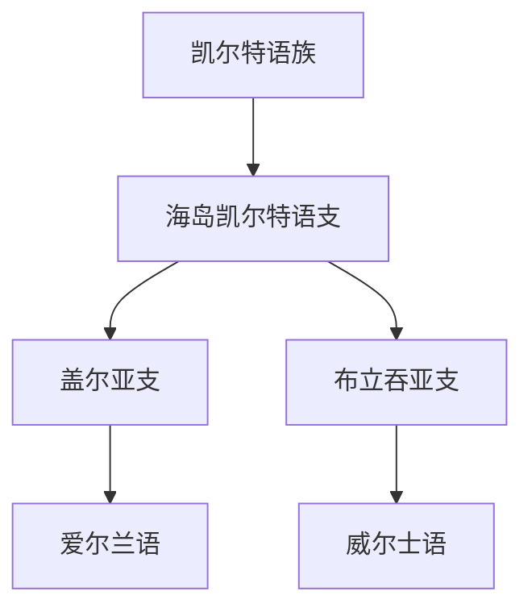

# 凯尔特语族

## 概括

凯尔特语族曾广泛分布于欧洲，现代主要保留在爱尔兰、不列颠和布列塔尼等地区。

## 分类关系

## 子系统

| 分支 / 语言 | 代表内容 | 说明 |
|---|---|---|
| 盖尔亚支 | 爱尔兰语 | 主要使用拉丁字母。 |
| 布立吞亚支 | 威尔士语 | 主要使用拉丁字母。 |

## 说明

现代凯尔特语言数量不多，但历史分布范围远大于今天。

## 上级

- [印欧语系](/%E4%BA%BA%E6%96%87%E7%A7%91%E5%AD%A6/%E8%AF%AD%E8%A8%80/%E5%8D%B0%E6%AC%A7%E8%AF%AD%E7%B3%BB/README.md)

