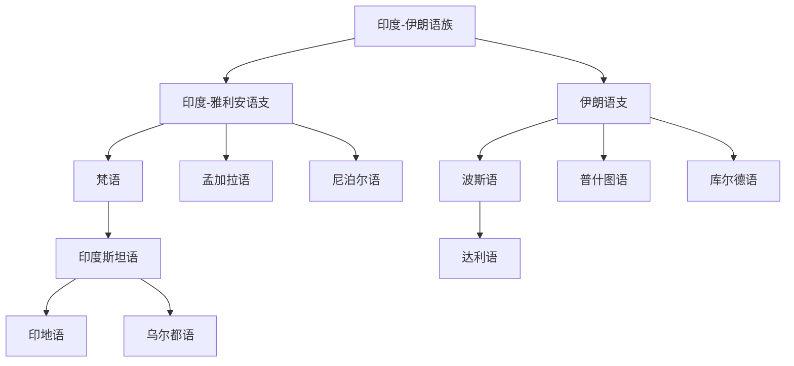

# 印度-伊朗语族

## 概括

印度-伊朗语族是印欧语系中覆盖南亚、伊朗高原和中亚的重要分支，通常分为印度-雅利安语支和伊朗语支。

## 分类关系

## 子系统

| 分支 / 语言 | 代表内容 | 说明 |
|---|---|---|
| 印度-雅利安语支 | 梵语、印地语、乌尔都语、孟加拉语、尼泊尔语 | 梵语是古典语言，现代印度-雅利安语言不是简单由现代梵语直接派生。 |
| 伊朗语支 | 波斯语、达利语、普什图语、库尔德语 | 西伊朗语支和东伊朗语支是常见下层分类。 |

## 说明

印地语多用天城文，乌尔都语多用波斯-阿拉伯字母；两者与印度斯坦语连续体关系密切。

## 上级

- [印欧语系](/%E4%BA%BA%E6%96%87%E7%A7%91%E5%AD%A6/%E8%AF%AD%E8%A8%80/%E5%8D%B0%E6%AC%A7%E8%AF%AD%E7%B3%BB/README.md)

